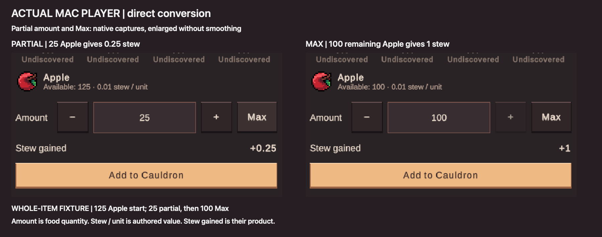

# Cauldron: one native interface

This follow-up removes the retired Cauldron uGUI route and its private presenters, references and collection prefabs. The native Toolkit interface continues to provide single-food conversion, Eva tasting, rewards and collections. Shared game calculations, save transactions, progression and other town interfaces remain in place.

The scoped removal is implemented and validated on Mac. Both scenes load cleanly, 79 focused tests pass, and four actual Metal Player phases pass. This is source cleanup on the existing development branch, with no merge or release. Publication is recorded separately after the tested diff is committed and the remote is verified.

## Apple quantities and decimals

The **Amount** control is food quantity. **Stew / unit** is the food's authored conversion value. **Stew gained** is their product. Apple has `baseValue=1`, `valueMultiplier=1`, and the existing conversion divides by 100: one Apple gives **0.01 stew**, 25 Apples give **0.25 stew**, and 100 Apples give **1 stew**. No food values or stored resource quantities are rounded by this cleanup.

The earlier image's 5,000,000,000.25 Apple balance was a deliberately large fractional test fixture, not a typical starting inventory. Fractional inventory can also arise through ordinary skill/resource/milestone multipliers: `ResourceGeneratingTask` multiplies its integer base drop into a `double`. The previous actual Apple harvest paid approximately 7.07 Apples, while its floating feedback displayed 7. Precision and overflow cases remain in the command tests; this review uses a readable **125 whole-Apple fixture**, converting 25 and then the remaining 100 with Max.

## Focused removal

The removed objects are the legacy `WindowUI`, `Collections` and `Cauldron_Window` hierarchies in Main and the isolated farming development scene. The live Cauldron manager and Toolkit screen survive. Each scene removes 678 retired records, including 145 GameObjects and 33 prefab instances; only the TownWindowManager legacy field and two parent child lists change among surviving records. All other surviving scene records are byte-identical.

The removed source comprises the old window/collection renderer, conversion presenter, pie and weight presenters, four private UI reference components, unused pie utility, and the obsolete legacy-to-Toolkit import menu. Its three collection prefabs have no surviving consumers. The native screen also loses unused legacy layout helpers and unattached pie/weight elements. Its definition keeps the config, portrait/pot animations and reward help exactly.

The shared mixing/collection/weight calculations, Cauldron manager/config, transaction journal, saved Eva/card state, animation sprites, theme, town attention hooks and unrelated uGUI components are retained. No asset pack or generic UI library is removed. All removed type and GUID references are audited before application and again after import.

## Validation and publication

- Main and the isolated development scene load with **zero missing scripts**, no legacy Cauldron components and a configured native screen. Main remains open, clean and outside Play; all unrelated surviving scene records are byte-identical.
- **79 focused EditMode tests pass**, with zero failures or skips. Command tests retain billion-scale and fractional precision cases.
- The **arm64 Mono Mac build succeeds with zero errors**. Two pre-existing warnings remain: iOS localization metadata is unconfigured; optional RuntimePipelineConfig is absent and its pipeline is disabled in Players. No diagnostics are suppressed.
- **Four actual Metal Player phases pass** with zero unexpected errors or runtime warnings: first use, reload, injected post-commit publication failure and restart recovery. Checks cover native town opening, 34 food slots, disabled empty/unknown entries, inedible saplings, unpaid-selection cancellation/reopening, Tasting details, − / + / Max, 25 Apple → 0.25 stew, remaining 100 → 1 stew, active quest progress, repeat prevention, failed disk save without publication, durable receipt reload and exactly-once recovery. Eva XP advances in the final fixture.
- Fresh compilation of the exact Git index passes all six game/Editor/test assemblies after the save-hardening commit. Existing analyzer warnings remain: UAC0005 in SaveSystemStressPlayModeTests, CS0184 in ToolkitNativeCutover, UDR0001 in GatheringBuffValidation, and three UDR0004 subscriptions in VasteriaStyleLab. Exact messages are retained in `publication-compilation.json`; standalone USG0001 informational messages concern the adapter's missing Unity AdditionalFile metadata.
- All **12 temporary source/settings guards are restored exactly** and both validation helpers removed. **88 other protected files, including save/cloud files, retain their hashes.** One existing preference file hash differs: Unity Performance Testing's `TestRunBuilder.Setup` writes `PT_Run`/`PT_Settings` in the authored Editor namespace, and its current metadata timestamp matches this test run. Immediate-before preference values were not retained, so an exact key-only delta is not claimed. Older preferences were not restored blindly. Future tests use the committed disposable OS-sandbox runner; changing productName alone does not isolate Editor test metadata.

The first runtime fixture retained Farming level 80 from the earlier fruit proof. Its level-50 Tasting Turmoil milestone adds 2 stew per taste, making a roll cost 3; the whole-Apple fixture held only 1.25 stew, so its Eva XP assertion failed while the native controls and conversion checks passed. That failed attempt is retained under `first-attempt-insufficient-tasting-fixture`. The final fixture uses Farming level 10, before that milestone, and all four phases pass. This changes only the disposable validation fixture, with no economy or progression adjustment.

The evidence folder retains the proposed and original scene/code bytes, reference audit, compiler diagnostics, focused tests, build messages, runtime reports, native screenshots and exact guard restoration. Prior stress and legacy-route images remain historical evidence; they are superseded as user-facing proof.

The Player uses Loading plus the isolated farming development Main scene. Production Main is independently loaded and inspected for configuration and missing scripts; its unrelated scene records are preserved. This follow-up does not retest normal-session economy, mobile/Windows/Linux Players, cloud accounts or physical power-loss behavior. Its disposable Player and saves are validation artifacts, with no merge or release.

## Earlier fruit slice

The earlier published feature introduced Apple, Pear, Peach and Cherry Farming adventure harvests, matching fixed-one sapling bonus drops, and append-only inventory/drop icon references. Those task/resource/art files are unchanged in this cleanup. Their existing actual Player harvest, XP, icon and pool-reuse evidence remains in the previous evidence folder and Library orchard image.

## Source evidence

Current cleanup evidence: `/Users/matthewrushworth/Projects/Echoes Cauldron Cleanup Evidence/2026-10-02`.

Earlier feature evidence: `/Users/matthewrushworth/Projects/Echoes Cauldron Orchard Evidence/2026-10-02`.

Coordination: `/tmp/eov-unity-coordination.json`. The harness and save hardening changes have independent ownership and publication records; they are excluded from this cleanup's commit scope.
