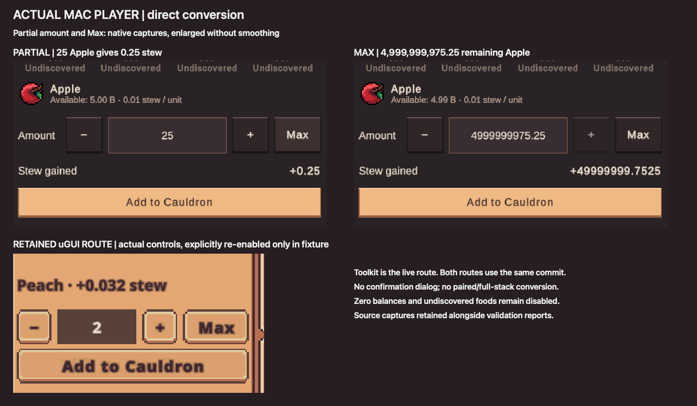
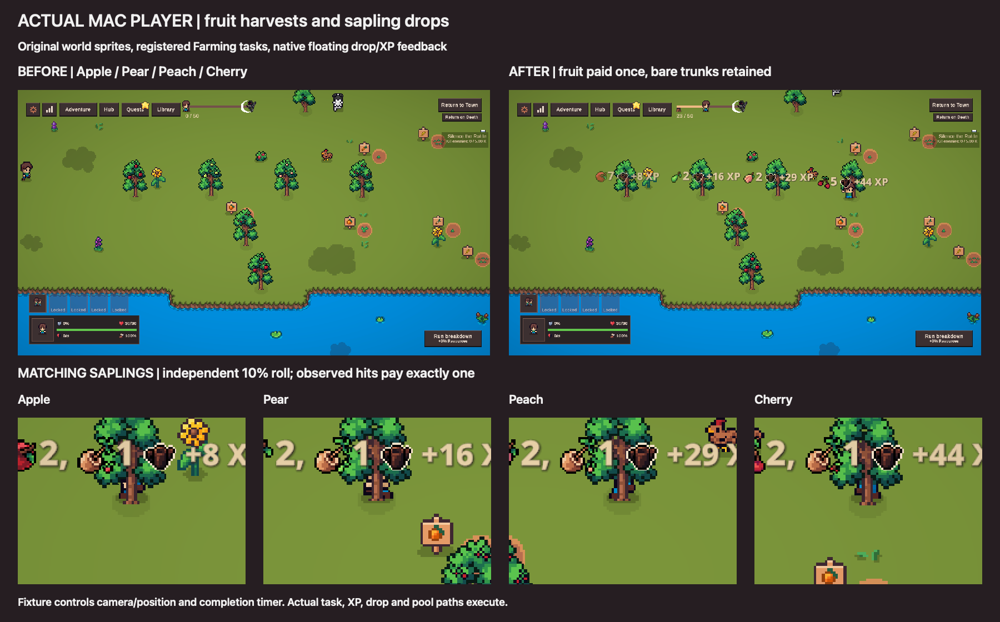

# Direct Cauldron conversion and adventure fruit harvests

The bounded implementation is complete and validated locally. Food now converts directly into stew: select one discovered food, enter an amount or use − / + / Max, then **Add to Cauldron**. There is no confirmation dialog. Eva’s tasting, XP, rewards and progression remain in place. Four Farming adventure tasks introduce Apple, Pear, Peach and Cherry, with matching sapling drops. This does not implement a town orchard or the broader garden expansion.

Publication uses the existing `fix/editor-startup-terrain-catalogue` development branch, after the reviewed foundation commit `ccbf33c6a`. The exact slice is recorded in `scoped-manifest.json` and `focused-existing.diff`; unrelated dirty work has been preserved. The required save codec, shared Oracle transaction lane, committed-resource publication hook and earlier icon/assembly foundations are committed first. This is source publication, with no merge or release.

## What the player sees

The live Toolkit route lists all 34 edible resources, including empty and undiscovered entries. Empty and undiscovered foods remain disabled. Selection uses stable resource identity; quantity and stew preview retain double precision, including balances above the integer limit. Saplings are explicitly inedible. The retained uGUI route has the same single-food command, editable quantity, − / + / Max and primary action; it was explicitly re-enabled only in the disposable fixture to test its otherwise inactive route.

These images contain actual Mac Player renders. The orchard fixture controls placement, camera, completion timer and a deterministic sapling-hit seed; registered task completion, resource payout, Farming XP, floating icons and pool reuse execute through game code. These are integration proofs, not measurements of normal adventure duration or random drop frequency.

## Authored balance

| Harvest | Farming unlock | Authored duration | Base XP | Fruit per completion | Stew per fruit | Spawn weight |
|---|---:|---:|---:|---:|---:|---:|
| Apple | 10 | 3 s | 8 | 2–6 | 0.010 | 350 |
| Pear | 27 | 4.2 s | 16 | 2–6 | 0.012 | 275 |
| Peach | 49 | 7.5 s | 29 | 2–6 | 0.016 | 200 |
| Cherry | 72 | 11.5 s | 44 | 2–6 | 0.025 | 150 |

Fruit uses the ordinary resource/yield rules. Each completion independently rolls **10% for exactly one matching sapling**, outside normal yield, tier, windfall and retreat multipliers. Saplings have zero sale/Cauldron value and `DisableAlterEcho=true`. They are stored as normal discovered inventory resources for future propagation work; planting is outside this slice. The existing run-summary tracker omits resources with `DisableAlterEcho`, so saplings appear in inventory and native floating drops but not that summary. No new summary exception was introduced.

Tasks use Farmlands as the primary area. Their terrain multipliers are 1.0 in Farmlands, 0.1 in Woods and 0.05 in River; other maps receive no additions. At Farming level 80 and adventure position 100, the actual picker selected orchard tasks 1,225 / 145 / 67 times respectively in 10,000 conditional Farming-category samples. Those counts confirm relative scarcity at that fixture, not whole-adventure spawn percentages. Existing map category weights, crop/fish values and task assets remain unchanged.

Unlocks fill gaps between existing crops. Fruit values follow nearby crop tiers rather than replacing the highest-value foods. Existing world tree sprites are reused; exhausted trees retain the existing generic mature tree. Premium fruit/sapling inventory art and each item’s own alpha silhouette provide known/unknown icons.

## Save and lifecycle contract

The conversion prepares a cloned candidate containing food debit, total-spent statistics, stew, active Cauldron quest progress and one bounded receipt. It joins the existing Oracle economic transaction lane, drains older saves, captures mutable contributors, durably writes the immutable candidate and only then publishes touched state and cache notifications. Deferred autosaves wait for the lane.

A receipt sequence prevents older commands from paying again after reload; an exact replay of the latest receipt succeeds without a second debit or payout. Invalid, nonfinite, unrepresentable or unaffordable quantities fail before publication. A disk failure leaves runtime resources/stew/progress unchanged. If publication throws after the durable commit, runtime writes are blocked until reload; restart recovers the committed candidate exactly once.

Fruit completion resets its notification only through a new protected opt-in hook used by `FruitHarvestTask`. Other task lifecycle behavior remains unchanged. The real pooled instance was reused twice for each species: two completions, two payouts, no duplicate payout from repeated Tick calls, and an exhausted trunk retained by `TaskController`.

## Verification and limits

- **79 EditMode tests passed; 0 failed or skipped**, covering conversion, orchard content, existing timber, save codec and farm transactions. `OracleBetaNamingTests` and its `PlayerPrefs.DeleteAll()` were not run.
- **arm64 Mono Mac build succeeded: 0 errors, 2 pre-existing warnings.** Exact warnings: iOS App Info localization metadata is unconfigured; optional RuntimePipelineConfig is absent, so Pipeline is disabled in Player builds. No legitimate diagnostics were suppressed.
- Actual Metal Player first run, durable reload, injected post-commit publication failure and restart recovery all passed with **0 unexpected errors and 0 runtime warnings**. Expected injected failures are retained separately in the JSON evidence.
- UI validation includes 25 Apple → 0.25 stew and Max 4,999,999,975.25 remaining Apple, exact active Regeneration40 progress, empty/unknown states, sapling rejection, Eva tasting/XP/rewards and both UI routes.
- Both icon sprite assets append glyphs 252–267. All previous 252 glyph and character entries are identical; old atlas pixels are identical after a 16-pixel top extension preserving their bottom-origin coordinates. The atlas importer’s prior bytes and references are unchanged.
- **All 12 temporary isolation files/settings were restored exactly**, helpers archived outside Assets and removed. Restored production sources compile without errors. Existing Editor warning remains: `ToolkitNativeCutover.cs(31,118): warning CS0184: The given expression is never of the provided ('SlicedFilledImage') type`.
- Fresh compilation of the exact Git index passes all six Runtime/Editor/test assemblies. The complete analyzer pass also retains pre-existing UAC0005 in SaveSystemStressPlayModeTests, UDR0001 in GatheringBuffValidation and three UDR0004 subscriptions in VasteriaStyleLab; exact messages are in `publication-compilation.json`. Its USG0001 informational messages arise from the standalone compiler adapter lacking Unity’s AdditionalFile metadata, not from the actual Player build.
- Main remains open, outside Play, unchanged: SHA256 `8f912645ea9216c7f25a833da730c44524aaea0dab7ba4cd76a9c0e1ac0d9d54`. Player fixtures used only disposable `/tmp` saves with platform/network guards. No real save was selected or written.

This validation is Mac/Metal at 1280×720. Mobile builds, portrait layouts, Windows/Linux Players, normal-session balance and real cloud/platform integration were not exercised by this slice. The isolated build is a validation artifact, not a release.

## Evidence and handoff

Original sources, screenshots, test XML, build/runtime reports, restoration hashes and focused changes are retained at:

`/Users/matthewrushworth/Projects/Echoes Cauldron Orchard Evidence/2026-10-02`

The Library selection image and closeup image replace the earlier mockups while preserving identity; the report and source bundle likewise retain their identities. The earlier confirmation mockup remains historical and is superseded by the approved direct action. The source/unknown icon contact sheet remains valid and unchanged.

Unity coordination is recorded at `/tmp/eov-unity-coordination.json`: the reservation has been released after exact restoration. The separate harness owner may validate a disposable snapshot. Save-hardening may use separate new save tests and investigate SaveImportExport/SaveManager; this slice does not own the pre-existing dirty SaveSystemStressPlayModeTests.
