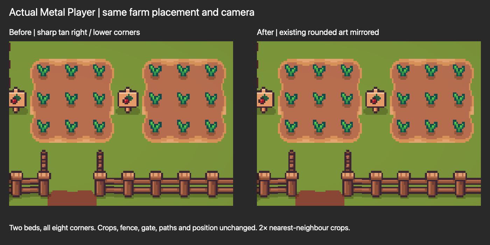
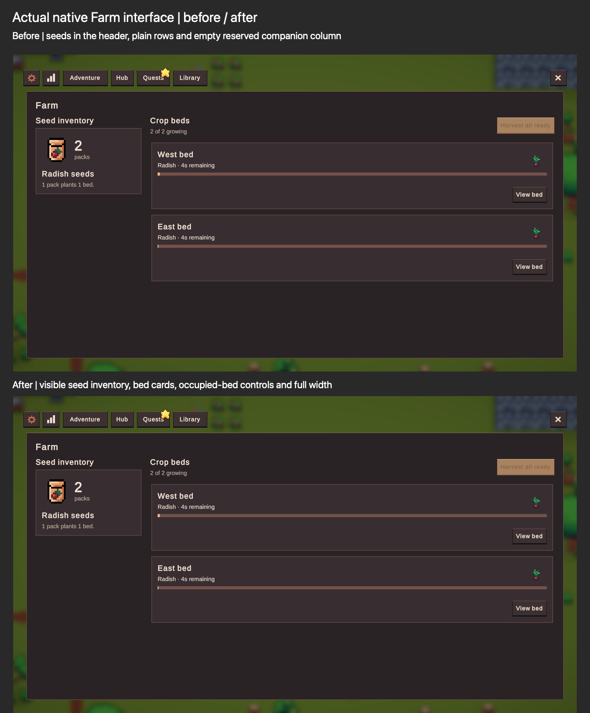

# Farm follow-up for review

The isolated farm now has consistent rounded soil, a native seed inventory and clearer bed controls. The bounded receipt journal passes replay/recovery tests and removes completed-history growth. No production quest, seed pool, Echo integration, new timber resources or release was added.

## Verified changes

- Soil: ten sprite/flip bindings reuse actual rounded corner and edge art across both original beds. All eight corners pass direct Player inspection. Positions, fences, gate paths and production Main are preserved.
- Interface: persistent known/unknown seed inventory, owned count, framed bed status/progress, explicit one-pack planting cost, View bed and Harvest all ready. Native EOV typography, colors and controls are reused. Zero owned packs retain their discovery. Landscape is independently accepted.
- Narrow layout: one Farm scroll owner and wrapped planting controls prevent local overlap, recursion and lost content. **Portrait is an unsupported-orientation stress test:** authored settings allow landscape only; the forced portrait capture creates a tiny central viewport and clips navigation. Landscape device/AOT checks remain outstanding. Actual failing and corrected constrained captures are retained.
- Receipt retention: per-bank lineage, issued sequences, contiguous committed watermark and per-bed paid plant sequence replace individual completed receipts. Fixed hit/miss intents, unresolved gaps and unknown legacy records remain saved. Legacy UUIDs close after their saved intents/active batches drain.

## Validation and performance

37/37 focused journal/model cases, 121/121 Unity EditMode cases and 51/51 PlayMode cases pass. Independent source review approves normal-path replay, fixed-roll retry, legacy closure and ready-bed avoidance. Four refreshed actual arm64/Mono Metal Player phases pass: native online actions/task retry/replay; one-month finite offline settlement; durable harvest publication failure/Loading Retry; actual save-bank transition and original-owner retry. Each reports zero unexpected gameplay errors/warnings. The deliberately injected publication failure is recorded separately and recovered without a second payout.

In the same managed-host fixture at 50,000 historical operations, serialized bytes shrink from **13,269,704 to 20,632**; median serialization drops from **65.8596 ms to 0.1714 ms** and growth capture from **9.0076 ms to 0.0003 ms**. One-time migration takes **9.9988 ms**. A separate 50,000 new-event stress run pays exactly 5,000 selected seeds and retains no individual receipts. These are managed fixture measurements, not Unity frames, disk I/O or mobile/AOT guarantees. Outstanding unpaid work and unknown records deliberately remain proportional to input; no destructive hard cap is used.

The Mac build succeeds with zero BuildReport errors and two configuration warnings: missing iOS localization App Info and missing RuntimePipelineConfig. Raw compiler/Editor diagnostics and teardown are retained; the pre-existing 2D Animation ComputeBuffer disposal and Mono finalization messages remain outside the gameplay report. The Editor also reports a missing GameAssembly.dSYM while attempting Cloud Diagnostics symbol processing for the Mono build; no account setting or diagnostic suppression was changed. iOS, Android and native Mac IL2CPP modules are absent and were not installed.

## Quest gate and tree proposal

**10% is approved behind a farming quest.** Ordinary ResourceDrop/DropResolver has skill gating only. The existing reusable check is QuestManager.IsQuestCompleted. Recommend new Barkley `Farm.FirstBeds` after **Tracking Twins** (`Meet Farmers1`, GUID `25bc32c449486874382b589899657abb`), requiring obtainable materials/work and no seeds. Check committed completion before RNG/staging; missing configuration fails closed. The exact new quest identity and costs need a content decision. The development PrepareBeds receipt is not an authored production quest, and this slice still has no production gate wiring. Additive/global seed pools and adventure Echo credit remain pending.

Existing woodcutting families are starter Tree levels **1/6**, Oak **13/18**, Birch **31/36**, Spruce **81/86**. All eight tasks share **Log57 / Stick2**. Recommend three material groups: starter/Oak base wood, then Birch, then Spruce. Preserve existing Log/Stick identities and owned balances. The recheck identifies Cute_Fantasy/Crops as the actual prepared seed/sapling source and finds additional generically named logs, branches and stacks in Outdoor_Decor, plus an unassigned resource-sheet cut-piece cluster. Exact species inventory mapping remains undecided, but the earlier broad absence/source-location claim is withdrawn. Native/enlarged candidate sheets and exact references are in tree-tier-proposal/recheck/README.md; no new art is currently justified by absence alone. No new resources/art were invented. The contact sheet is `libfile_75c4473eaa10819192d83b195c0c03df`, version0.

## Asset continuity and review boundaries

All seven prepared seed inventory/atlas files match the prior verified checkpoint. The 22 known packets and shared unknown keep correct transparency, centered pivots, point filtering and 16×16 inventory geometry. Only the outer 40-pixel halo was removed from inventory icons; pale packet material stays. Drop glyphs retain the halo. All 23 appended names/fileIDs at indices213–235 remain verified; 213 old definitions and 55,296 old atlas pixels were preserved. Existing icon/concept Library identities remain unchanged.

The final preservation record verifies production Main's original hash, clean Edit mode, exact restoration of all 12 temporary source/settings guards, removed/archived validation helpers, 77 unchanged actual player files and 93 unchanged backups. The disposable Player and all raw source/log/capture evidence remain under `../Echoes Farming Implementation Evidence/2026-10-01/receipt-retention`. Earlier failing isolation/layout versions remain recoverable. The current branch and all unrelated Mac/migration/art work are preserved. No commit, push, merge or release occurred.

Review [journal details](receipt-retention.md), [actual UI/soil evidence](ui-soil-review.md) and [quest/tree audit](tree-tier-proposal/README.md). Remaining decisions are the authored first-farm gate/costs, seed source/Echo rules, and selection/mapping of verified existing timber art. Supported landscape AOT/device upgrade checks are separate engineering gates. Orchard remains a separate optional area; no orchard implementation was added.

## Verified Library refresh

All seven existing actual Player images are now version1 with identity/history preserved. New files below are version0.

| Deliverable | Library ID |
| --- | --- |
| seed-inventory-native-farm.png | `libfile_900f2a24041481918c0eb712a891303d` |
| soil-actual-player-before-after.png | `libfile_b6ecf8e4dcf88191a17d46dfc301f524` |
| native-farm-actual-player-before-after.png | `libfile_4af12f6d8a408191803ffdb657a8a1dd` |
| farm-portrait-current-limitation.png | `libfile_d06fd4021c4c81918308e2f23a88fc98` |
| Echoes-farm-followup-final.md | `libfile_6c1666e4ff0081919690b26a9bc66369` |

## Design-session pause

Further farming mechanics/UI and balancing work is paused. Watering, harvest XP, crop mastery and growth-speed ideas remain tentative. Current behavior and integration constraints are documented in design-session-briefing.md, with no implementation approval inferred.
