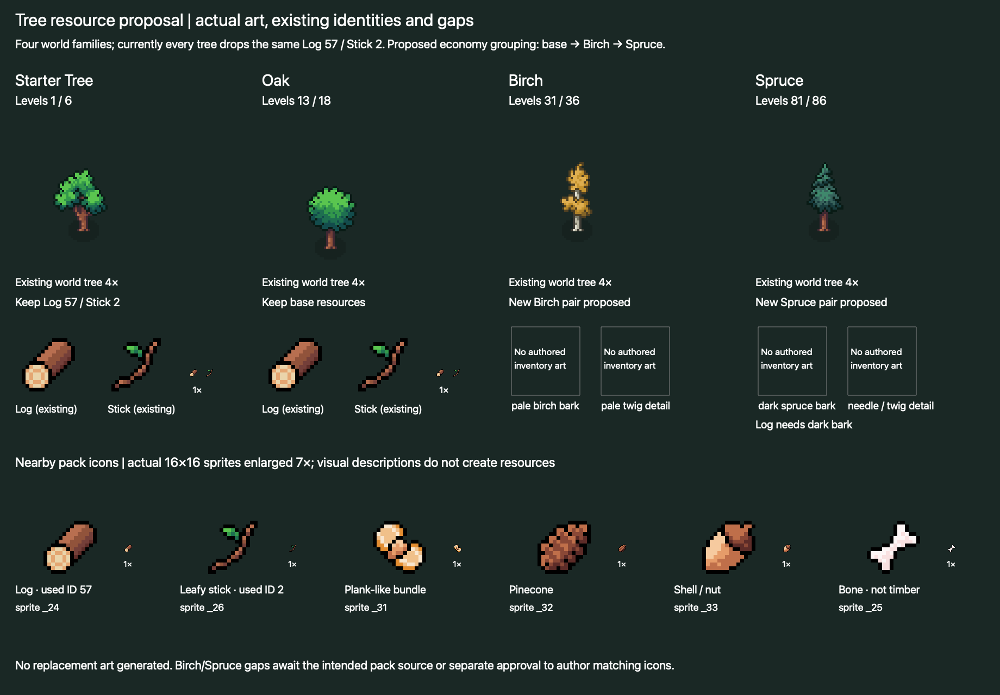

# Farming quest gate and tree resource proposal

Read-only audit, 1 October 2026. The user approved a 10% seed chance behind a farming quest. Additive rewards and adventure Echo eligibility remain pending. No quest, resource, drop table, production art or scene was changed by this audit.

## Recommended quest hook

Ordinary drops currently have **no quest gate**. `ResourceDrop` and `DropResolver.IsDropUnlocked` only support skill levels; `TaskData` gates task availability by skill level. The existing working predicate is `QuestManager.IsQuestCompleted(QuestData)`: it checks the current save's quest record and its `Completed` flag. Buff eligibility and Cauldron collections use it. `AlterEcho.requiredQuest` is an authored field, but current `AlterEchoGenerationManager` does not consult it, so that field is not proof of working quest-gated drops.

The first existing Flora/Tillman collection quest is **Unlock Corn**, GUID `c83b4b0590bf39a498aef150278941ac`: it requires 100 ordinary Radish and the completion of **Tracking Twins**, GUID `25bc32c449486874382b589899657abb`. Tracking Twins is Eva's existing `Meet Farmers1` quest. There is no authored Unlock Radish or prepare-farm quest. Existing Fence1 is a 1,250-Stick Barkley quest that grants distance; it is not a farming quest.

Recommend a **new authored quest ID `Farm.FirstBeds`**, visible as “Prepare the first beds”, with Tracking Twins as its proposed prerequisite. This is a proposed ID/hook, not an approved condition or newly created asset. Use already obtainable logs/sticks or existing work requirements; **never require seeds to unlock seed acquisition**. The current development-only 10-Log/20-Stick cost is not approved production tuning. The new quest should be registered through the existing quest asset list, native quest UI, localization and explicit completion cohort.

Do not reuse old Unlock Corn/Fence1 completion as new farm access: that bypasses the user's new requirements for legacy players. `Farm.PrepareBeds` currently exists only as a development transaction-created completion record, without a matching authored QuestData asset. Do not silently treat that record as an authored farming hand-in or fabricate a second completion from bed ownership.

For seed eligibility, configure an explicit required-quest reference on the future typed seed pool, then check that quest's committed completion in the captured save owner **before RNG and before staging any hit/miss intent**. Missing configuration, quest manager or record must fail closed. An active, ready-to-hand-in or merely owned-bed state must not pass. The precise Radish source remains task 28, GUID `42f81ca90b736cd4bb035112a8b22ad3`, Farming level 1; eligible post-gate completions use the approved 10% probability. Do not gate its ordinary Radish reward.

Preserve an eligible event's owner, slot, operation ID and fixed result across retry. Do not reevaluate an already-earned event against a different selected save or later UI state. Historical ungated **development** farm intents need an explicit test-state policy if kept for manual testing; they are not evidence of a previously released farm save format. No released-save migration or pending-credit deletion is proposed here.

If the quest spends materials and grants bed access together, make them one immutable farm commit with an authored quest completion; do not additionally run generic `CompleteQuest` resource charging and then the existing paid `PrepareBeds` command. That would charge twice and split the success state.

Minimum gate checks: before hand-in, 1,000 simulated completions produce zero RNG calls, seed changes or pending events; after committed hand-in the 10% route becomes eligible; failed hand-in save remains closed; no seed requirement causes a circular prerequisite; a staged eligible event retries once into its original owner; old crop unlocks and Fence records do not satisfy the new ID. Parent receipt tests remain the source of implementation evidence.

**Design decision needed:** approve the new `Farm.FirstBeds` quest and its prerequisite/material requirements, or explicitly select an existing quest. Tracking Twins alone is an available meet gate but not a new farming/build quest; Unlock Corn is available but conflates the first farm with the old crop collection chain.

## Actual tree tiers and current drops

The checkout has eight authored woodcutting tasks and **four world-art families**, not three. The starter family uses Fruit Tree world art but awards no fruit. All eight still award the same Stick and Log resources. A three-tier material economy can group starter/Oak as base wood, followed by Birch and Spruce, without adding an unnecessary fourth pair.

| World family | Medium task / required level / seconds | Large task / required level / seconds | Current medium Stick / Log range | Current large Stick / Log range |
| --- | --- | --- | --- | --- |
| Starter Tree (fruit-tree art) | 1 / 1 / 2 | 2 / 6 / 3 | 1–3 / 1–2 | 2–8 / 1–5 |
| Oak | 4 / 13 / 3 | 5 / 18 / 6 | 1–5 / 1–3 | 3–9 / 3–8 |
| Birch | 7 / 31 / 3 | 8 / 36 / 7 | 1–6 / 2–4 | 4–10 / 5–12 |
| Spruce | 10 / 81 / 4 | 11 / 86 / 10 | 1–7 / 4–8 | 4–15 / 7–22 |

All two-entry pools have equal weight 1 and extra-slot chances 0.3/0.2. The first slot selects either Stick or Log; a successful first extra slot can add the other. With only two distinct entries, the second extra slot has no remaining candidate. Serialized per-drop minX/maxX fields are not members of current `ResourceDrop` and do not implement an additional eligibility gate. Authored task skill requirements, spawn terrain and effective distance rules still apply.

Existing identities must survive: **Stick ID 2**, GUID `024c1162874b64e43be92b8892b40efb`; **Log ID 57**, GUID `e8ace32c9cea7aa4aa202557d1f972ea`. Their names are resource/save keys used by existing Barkley costs and other resource systems. Do not rename them into Birch, redistribute existing balances by species or turn Dlog ore into a tree tier. New Birch/Spruce resource IDs, demand, values and drop replacement versus mixed output need separate review.

Library contact sheet: `libfile_75c4473eaa10819192d83b195c0c03df`, version0.

## Art audit correction and available choices

The first contact sheet above is historical and its empty species cells are not proof of absent reusable art. The [pixel-grounded recheck](recheck/README.md) supersedes that conclusion. The actual prepared crop/sapling source is Cute_Fantasy/Crops. Additional generically named authored logs, branches and stacks exist in Outdoor_Decor, with sibling MilitaryCamp/Desert alternatives. `_31` in the resource sheet is an unassigned pale cut-piece cluster; its earlier exclusion as planks was unsupported. No replacement art or new resource was made.

Review the four new native/enlarged contact sheets and exact references before deciding a three-group timber mapping. Correctly labelled Birch/Spruce inventory pairs are not established, but unlabeled candidates are available. No request for a missing pack or new icon generation is currently needed. Further mechanics/UI work is paused for the collaborative design session.

## Evidence and preservation

- [Eight task assets, exact quantities, GUIDs and world sprite references](tree-task-index.json)
- [Inventory sprite rectangles and fileIDs](resource-art-index.json)
- [Complete resource sheet at 6×](resource-sheet-audit.png)
- [Complete UI tools/gear sheet at 6×](ui-pack-complete-audit.png)
- [All pack image paths](pack-image-inventory.json)
- [Read-only source hashes](audited-source-hashes.json)
- [Reproducible contact sheet compositor](compose-contact-sheet.swift.txt)

No Unity operation, gameplay implementation, new resource, quest asset, account change, save operation, commit or release occurred. Main and other workers' source changes were not written by this task.
