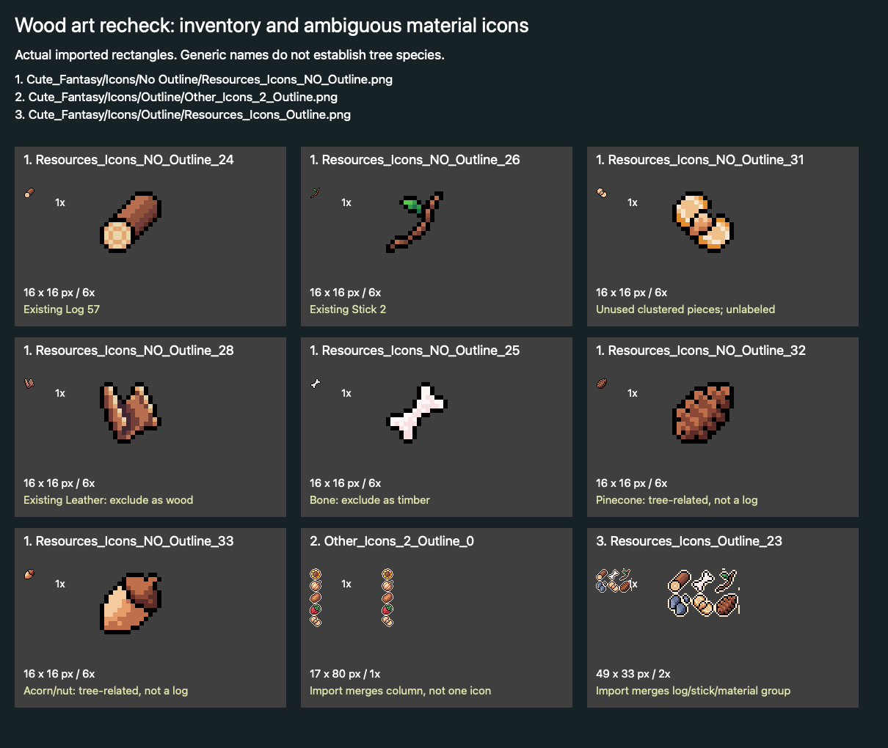
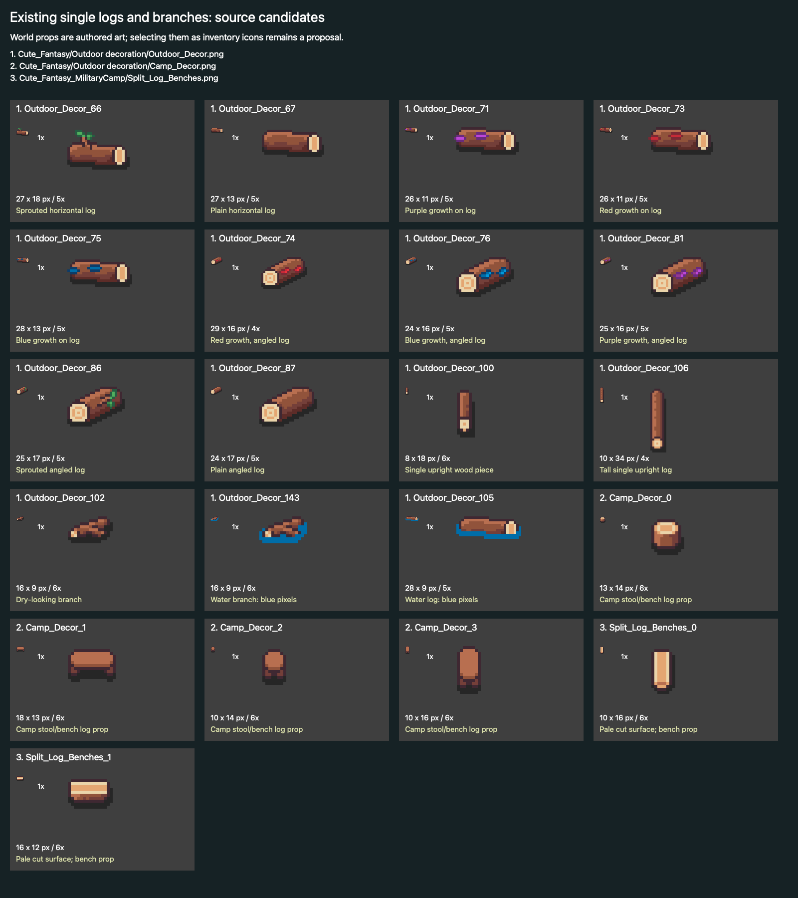
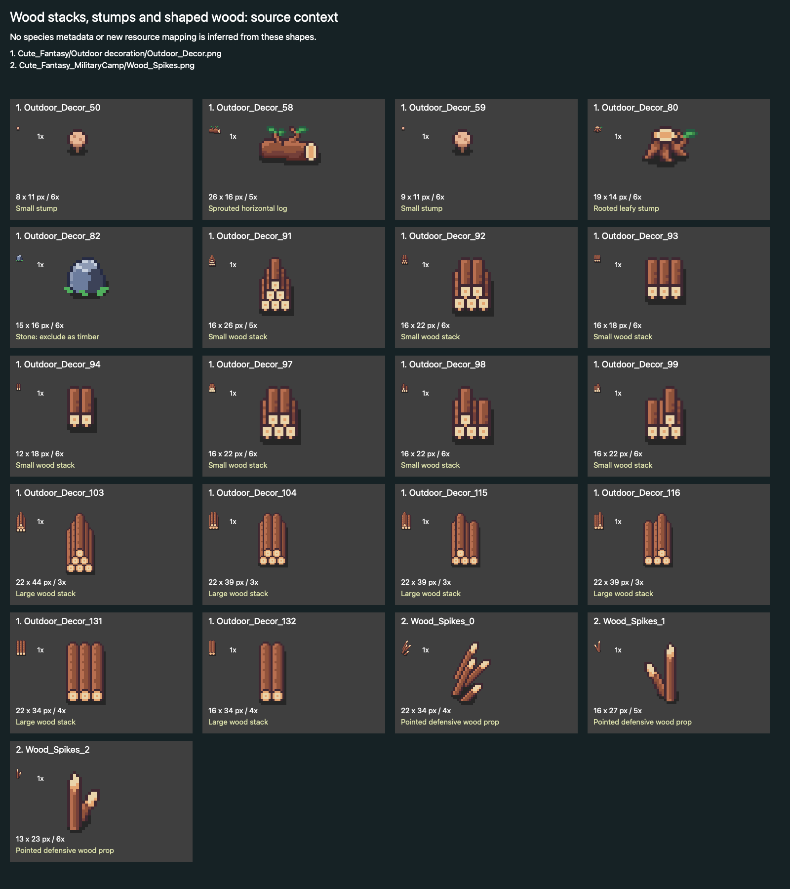
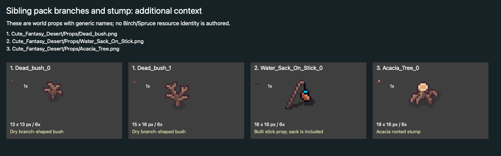

# Tree art recheck and orientation correction

Read-only source/asset audit, 1 October 2026. New figures show existing authored pixels at native and enlarged scale, using actual imported sprite rectangles. No replacement art, resource, gameplay/UI change, Unity operation or release was made.

## Findings for review

**The earlier absence conclusion was too broad.** Additional logs, branches and stacks exist in Cute_Fantasy's generically named outdoor sprites. The user does not need to locate a pack before reviewing these candidates. The remaining question is selection and intended semantic mapping, not a demonstrated lack of wood art.

The exact checked-out source used for the prepared seed packets is `Assets/Art/Packs/Cute_Fantasy/Crops/Crops.png`; supplemental crop art is `Crops_2.png`, and the authored sapling/young/mature world sprites are `Crops/Fruit_Tree_Stages.png`. The pack directory is **Cute_Fantasy**. No separate farming-pack directory was identified. This identifies the art actually used, without claiming it exhausts a separately purchased package.

- Inventory: the current Log 57 uses `Resources_Icons_NO_Outline_24`; Stick 2 uses `_26`. `_31` is an unassigned cluster of pale round ends with brown sides. It is a plausible cut-wood candidate; its generic name does not identify species or establish planks. The previous “plank-like bundle” exclusion is withdrawn. `_28` is already Leather and `_25` is bone. Neither is evidence of a new wood variant. Pinecone `_32` and acorn `_33` are tree-related items, not logs.
- Base-pack world props: `Outdoor_Decor_67` and `_87` are plain logs in horizontal/angled views; `_66`, `_58`, `_86` add shoots; `_71`, `_73`, `_75`, `_74`, `_76`, `_81` have colored growth. `_102` is a small brown branch; `_143` and `_105` include blue water pixels. Numerous `_91`–`_132` stack variants are shown individually. These are genuine authored sprites, often larger than the 16×16 inventory convention, and have not been converted or assigned to resources.
- Siblings: MilitaryCamp `Split_Log_Benches_0/1` have pale cut surfaces but are benches, not authored Birch-labelled drops. `Wood_Spikes_0/1/2` are defensive props. Desert `Dead_bush_0/1` are dry branch-shaped bushes; `Water_Sack_On_Stick_0` includes a sack. Acacia's stump is rooted world art. These are alternatives to inspect, not approved timber icons.
- Import caveat: `Other_Icons_2_Outline_0` is one 17×80 imported column containing several objects, including the pale cluster at the bottom. That source image does not currently expose the cluster as a separate usable outline sprite. `Resources_Icons_Outline_23` similarly imports a 49×33 group containing the log, bone, stick, chips and pale cluster, rather than individual timber icons. Both imported groups are shown exactly on the inventory contact sheet. Any later selection needs a safe additive slice, preserving existing references. No importer was repaired in this read-only task.

**Factual proposal, pending the design session:** retain existing Log/Stick identities and show the unlabeled cluster, plain outdoor logs and small dry branch as actual available choices. Do not invent species labels from filename absence, equate pale cut faces with Birch bark, or create four replacement icons before these choices have been reviewed. Distinct, correctly labelled Birch/Spruce inventory pairs were not established by this audit; unlabeled alternatives were established. The gameplay mapping and demand remain undecided.

## Contact sheets

All plausible small timber candidates identified in the inspected sheets are included, with exact pack-relative paths and imported names. Stone/Leather/bone and composed props remain visibly classified rather than silently counted as logs. Full contexts are retained: [resources](resources-both-full.png), [other icons](other-icons-full.png), [outdoor and camp sheets](outdoor-props.png), [water animations](water-wood.png), [MilitaryCamp wood](military-wood.png), [UI icons](ui-icons.png), [sibling decoration sheets](sibling-props.png), [Desert trees](desert-tree-props.png), [crop/sapling art](crops-extra-and-saplings.png) and [recovered tools](recovered-tools-full.png).

Inspected siblings include Dungeons objects/water decor, Volcano plants, Christmas/Halloween decoration sheets, MilitaryCamp and Desert props; the UI icon sheet contains interface symbols rather than timber inventory variants. OpenInc's duplicate Cute_Fantasy crop, resource and other material sheets are byte-identical to this checkout. A local source inventory was searched, but a file inventory alone is not proof that every frame was visually audited. This report limits absence claims to the documented visual coverage.

## Exact candidate references

| Path | Exact sprite name | GUID | FileID | Rectangle |
| --- | --- | --- | --- | --- |
| Assets/Art/Packs/Cute_Fantasy/Outdoor decoration/Outdoor_Decor.png | `Outdoor_Decor_67` | `3ee70b1ac7bcd50418151342d61f2448` | `-8626580073517602967` | {'x': 67, 'y': 289, 'width': 27, 'height': 13} |
| Assets/Art/Packs/Cute_Fantasy/Outdoor decoration/Outdoor_Decor.png | `Outdoor_Decor_87` | `3ee70b1ac7bcd50418151342d61f2448` | `161095336066457017` | {'x': 37, 'y': 223, 'width': 24, 'height': 17} |
| Assets/Art/Packs/Cute_Fantasy/Outdoor decoration/Outdoor_Decor.png | `Outdoor_Decor_102` | `3ee70b1ac7bcd50418151342d61f2448` | `-2908102024638348874` | {'x': 112, 'y': 163, 'width': 16, 'height': 9} |
| Assets/Art/Packs/Cute_Fantasy_MilitaryCamp/Split_Log_Benches.png | `Split_Log_Benches_0` | `b3a32766dbb2726439d072b751ee7d43` | `-5831960633806610129` | {'x': 4, 'y': 0, 'width': 10, 'height': 16} |
| Assets/Art/Packs/Cute_Fantasy_MilitaryCamp/Split_Log_Benches.png | `Split_Log_Benches_1` | `b3a32766dbb2726439d072b751ee7d43` | `4763187427778735702` | {'x': 16, 'y': 3, 'width': 16, 'height': 12} |
| Assets/Art/Packs/Cute_Fantasy/Icons/No Outline/Resources_Icons_NO_Outline.png | `Resources_Icons_NO_Outline_24` | `f84262455b69072498ba0e2afc130d21` | `8831195269540349854` | {'x': 0, 'y': 16, 'width': 16, 'height': 16} |
| Assets/Art/Packs/Cute_Fantasy/Icons/No Outline/Resources_Icons_NO_Outline.png | `Resources_Icons_NO_Outline_26` | `f84262455b69072498ba0e2afc130d21` | `1587561915571280470` | {'x': 32, 'y': 16, 'width': 16, 'height': 16} |
| Assets/Art/Packs/Cute_Fantasy/Icons/No Outline/Resources_Icons_NO_Outline.png | `Resources_Icons_NO_Outline_31` | `f84262455b69072498ba0e2afc130d21` | `-9113704954070863861` | {'x': 16, 'y': 0, 'width': 16, 'height': 16} |
| Assets/Art/Packs/Cute_Fantasy_Desert/Props/Dead_bush.png | `Dead_bush_0` | `36ad40cc14d8417489e27a2ac379c38b` | `1869835317140120249` | {'x': 1, 'y': 0, 'width': 13, 'height': 13} |
| Assets/Art/Packs/Cute_Fantasy_Desert/Props/Dead_bush.png | `Dead_bush_1` | `36ad40cc14d8417489e27a2ac379c38b` | `-7954065678426861407` | {'x': 16, 'y': 0, 'width': 15, 'height': 16} |

The [full sprite reference index](sprite-reference-index.json) records imported names, GUIDs, fileIDs and actual rectangles, including outlined sheets whose generic suffixes cannot safely be interpreted as a uniform grid. All source GUIDs/fileIDs remain unchanged.

## Supported orientation

`ProjectSettings/ProjectSettings.asset` explicitly disables portrait and upside-down portrait, enables both landscape rotations and OS autorotation, with default 1920×1080. No Screen.orientation/autorotation override was found in inspected gameplay source. The forced 720×1280 capture is an **unsupported-orientation stress test**, not a blocker for the authored landscape setup. Its tiny 16:9 central region and clipped navigation remain honest evidence; this correction does not turn it into a pass. Native iOS/Android/AOT/device checks remain unperformed and are separate from landscape Mac validation.

## Preserved work and next review

Main, saves, source/assets/settings and existing icon/atlas work are preserved. All mechanics/UI implementation is paused for collaborative design. [The factual design-session briefing](../../design-session-briefing.md) separates current adventure behavior, the isolated prototype and tentative ideas. Earlier figures remain available for comparison; this contact set supersedes the broad art-absence statement rather than overwriting its evidence.

## Verified Library delivery

| Figure/report | Exact Library ID | Version |
| --- | --- | --- |
| inventory-candidates.png | `libfile_d2f42ba25db48191baf78e649148d723` | 2 |
| world-log-candidates.png | `libfile_32b9412658a08191be44d6992a3f69b5` | 1 |
| wood-stack-candidates.png | `libfile_2373b6f227448191b0229489d7295b0c` | 1 |
| sibling-branch-candidates.png | `libfile_5241db8b8ea48191a82dca52cfe96cf0` | 1 |
| Echoes-tree-art-recheck.md | `libfile_ae7220fc6a548191968197b061dbdf76` | 2 |
| Echoes-farm-design-session-briefing.md | `libfile_b94a552807808191a0dedea6e44aec4e` | 1 |
| Echoes-farm-followup-final.md | `libfile_6c1666e4ff0081919690b26a9bc66369` | 1 |

Final contact-sheet layout keeps sprite names clear of tall props. Malformed grouped outline imports are context at their actual sizes; individual known/ambiguous inventory candidates have enlarged native-pixel views. No asset pixel was restyled.
