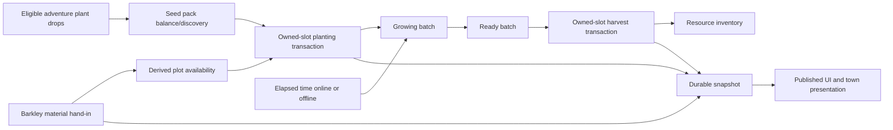

# Engineering and migration

## Actual integration map

Plant seed routing must branch at `ResourceGeneratingTask.GenerateDrops`, before ordinary skill/buff/resonance multiplication and ResourceManager.Add. TaskController completion callbacks are useful for reward identity/attribution, not a replacement all-gathering guarantee. New seed drop pools and integer balances need typed adapters; no gameplay code is changed by this plan.

| Owner | Current entry or data flow | Required change |
| --- | --- | --- |
| [GameplayStatTracker](../../../Assets/Scripts/Stats/GameplayStatTracker.cs) | Run resources and duration update BestPerMinute on return/abandonment | Keep farm harvest out of adventure statistics; route typed seed drops only from reviewed adventure plant rewards. |
| [AlterEchoGenerationManager](../../../Assets/Scripts/NpcGeneration/AlterEchoGenerationManager.cs) | Rebuilds earned-resource generators; ticks them with unscaled delta; applies offline time | Freeze retired generators through explicit system state, then remove recurring production after migration. |
| [AlterEchoGenerator](../../../Assets/Scripts/NpcGeneration/AlterEchoGenerator.cs) | Binds a DiscipleGenerationRecord; collects stored resources; guards ownership across slot changes | Retain the ownership pattern for asynchronous farm transactions and any approved legacy claims. |
| [AlterEchoCropGrowth](../../../Assets/Scripts/NpcGeneration/AlterEchoCropGrowth.cs) | Repeating Progress/Interval selects growth sprite | Replace with a plot-state presenter; mature state must remain stable. |
| [TownWindowManager](../../../Assets/Scripts/UI/TownWindowManager.cs) | Opens native Toolkit Alter Echoes and optional inventory | Route to farm screen and add any legacy-earnings section only if explicitly approved. |
| [ToolkitNavigationScreen](../../../Assets/Scripts/UI/Toolkit/ToolkitNavigationScreen.cs) | Hub badge sums pending generator balances | Show ready beds; a legacy claim indicator is conditional on approval; do not sum seed/crop quantities into one meaningless badge. |
| [ResourceManager](../../../Assets/Scripts/Upgrades/ResourceManager.cs) | Add applies resource-tier bonus even with statistics/tier-roll flags off | Define pre-bonus or final harvest yield once; ensure preview and actual payout match. |
| [QuestManager](../../../Assets/Scripts/Quests/QuestManager.cs) | Completes resource hand-ins, emits QuestHandin, captures contributors | Aggregate all costs and check every spend; define durable completion semantics for new farm commands. |
| [QuestObjectStateController](../../../Assets/Scripts/Quests/QuestObjectStateController.cs) | Before/during/after quest object sets | Reuse for clearing/build presentation, using new stable quest IDs and derived farm-stage presentation. |
| [CardPoolManager](../../../Assets/Scripts/Upgrades/Cauldron/CardPoolManager.cs) | Resource card eligibility uses DisableAlterEcho | Introduce explicit retired/farm card eligibility; cover grouped, ordinary and lowest-count pools. |
| [CauldronManager](../../../Assets/Scripts/Upgrades/CauldronManager.cs) | Resource cards modify generation; inventory can become stew | Retire generation investment without compensation; validate stew acceleration. |
| [GameData](../../../Assets/Scripts/Blindsided/SaveData/GameData.cs) | Schema3, Disciples, AppliedMigrationIds, quest/card records | Add separate versioned farm records while retaining old data. |
| [SaveMigrationRunner](../../../Assets/Scripts/Blindsided/SaveData/Migrations/SaveMigrationRunner.cs) / [Oracle](../../../Assets/Scripts/Blindsided/Oracle.cs) | Detached Odin clone; commit migrated candidate before publishing | Perform conversion here, not in a repeated OnLoadData reward callback. |
| [SaveManager](../../../Assets/Scripts/Blindsided/SaveData/SaveManager.cs) | Snapshot generations, valid heads, slot authority and conflicts | Preserve refusal of conflicting valid branches; no blind plot merge. |

## Proposed records and model

Use stable authored `plotId` and `recipeId`, independent of scene hierarchy names. Suggested farm record: data version, plot dictionary, seed balances and cumulative committed pack-acquisition totals (discovery is derived, not another flag), durable rolled-reward identities, meaningful build quest/phase records, stage-payment receipts and settlement identities, retirement/source archive and any approved claim ledger and expansion counters. Each plot stores recipe, planted batch identity, bounded growth progress, timestamp baseline, batch yield definition and ready state. Freeze recipe version/yield at planting, or define a deliberate upgrade policy; patching a recipe must not silently change an already paid batch.

Projected state machine: Locked → Empty → Growing → Ready → Empty. Locked/recipe eligibility are computed from game-authored requirements, retained actual skill progress, meaningful quest/phase facts and new seed discovery; do not serialize redundant PlotUnlocked/RecipeUnlocked flags. Commands reject invalid transitions. Unknown recipe or resource IDs remain preserved and visibly unavailable rather than deleting value. Visual plant count is decoration; the transaction unit is the batch.

A pure model/service should own growth and validate commands. Town presenters bind plot IDs to verified growth sprites. Native Toolkit UI binds the same model; it does not own the clock or inventory mutation. Stop per-frame generator searches and unnecessary scene polling once bindings are installed.

## Time and offline behavior

Use real elapsed time for the same planted batch in town, adventures and offline. Scale is independent of Time.timeScale and skill task-speed bonuses unless an authored farm benefit says otherwise. Persist progress and a validated stored UTC baseline, subject to the bounded local-clock policy below. Foreground transitions rebase exactly once; zero elapsed time is harmless. Future, backward, invalid and nonfinite values cannot grant negative progress or a second payout.

Elapsed time is clamped to the remaining batch duration. A month away therefore yields at most the batches planted before leaving. Ready crops stop accruing. Do not borrow GameData.OfflineTimeCap assuming it applies: the current Alter Echo offline routine is uncapped and does not use that field. Large elapsed gaps must remain constant-time rather than iterating harvest cycles.

Running growth uses monotonic elapsed time; resume reconciles once and discards surplus. Repeated artificial offline advances across successive seeded batches can still accelerate held packs. Recommend accepting this local/offline limitation, with adventure-only supply and finite held seed stock, without an approved stock cap, rather than claiming finite batches prevent it. [Clock policy and rollback/rebase tests](proposed-contracts.md) describe exact handling; no authentication or server-time service is proposed.

## Transactions and save ownership

The proposed owner is **Oracle's existing save coordinator**. FarmService validates pure commands; it does not start a second writer. Admission checks CanBeginSaveMutation, HasCurrentSlotData and slot/tree/batch identity. First-release farm mutations are town-only after pending adventure rewards drain; growth remains active on adventures.

Use a short economic command barrier, coalesce autosaves, capture existing contributors, clone, validate aggregated costs and commit a typed candidate through Oracle's existing write lane. After confirmed authority success, patch only affected farm/inventory/quest fields and ResourceManager caches into the same live tree, then notify once. Do not replace the complete live GameData after an asynchronous runtime write. Queue whole quest/mix/craft/conversion operations, not individual Spend calls whose failures existing callers can ignore.

External pause/quit must use a unified blocking drain that confirms and publishes the typed delta/cache updates before capturing contributors or writing a lifecycle snapshot; the current status-only drain is insufficient. Ambiguous/failed publication cannot write old live economics over a committed candidate.

The in-memory coordinator journal records operation/ownership/touched-field deltas; successful snapshots contain final state and claim identities. A failure leaves the candidate unapplied. A crash after commit but before publication reloads the already-paid/emptied state and never replays Add. Ambiguous authority or publication failure enters recovery. Recommend one atomic Harvest Ready commit for the captured sorted ready-batch set, with all recipes validated and bonuses applied once. An unresolved recipe makes zero changes rather than hidden partial success.

[The complete coordinator sequence and concurrency/failure tests](proposed-contracts.md) define reward attribution, run-end ordering, autosave and lifecycle/slot gates. This is an architecture proposal requiring new typed adapters and tests; current EventHandler.SaveData capture is not a durable disk commit.

## Migration

The [released-format audit](../save-migration-feasibility-2026-09-30/README.md) now supplies concrete typed/string/ES3 ingestion, omission and receipt-alias evidence. Farm schema/version selection and per-platform migration remain provisional; runtime/device and economic-publication gates still apply. Mobile migration versus reset/legacy choices and Steam legacy branch fallback are being considered, not approved. If migrating, use SaveMigrationRunner's detached clone and Oracle's commit-before-publication path; preserve source records/unknown keys for audit and use explicit retired state rather than changing every DisableAlterEcho flag, which also controls tier upgrades, cards and inventory presentation.

No finite compensation table or old investment→farm bonus conversion should be authored. No recurring OnLoadData reward. Existing ResourceInventory remains owned; unclaimed StoredResources require the explicit ruling in the retirement matrix. Archive their source values while that ruling is open, without payout or deletion. Historical generation rates are unavailable, so no reconstructed accrual or transition allowance is proposed. Seed migration initializes every pack zero/undiscovered for all legacy and fresh saves. Do not derive pack discovery from crop Earned/levels/card or quest history. First committed new-version pack acquisition increments its lifetimeAcquired counter; derive discovery from that actual history, preserving it at zero balance and across later upgrades. The earlier starter grant is withdrawn.

Use the current mapping in [proposed-contracts.md](proposed-contracts.md): meaningful Fence/house completion, partial progress and earned distance remain history; no automatic Fence→new farm ownership or crop-access grant. New requirements are authored once in code/assets and evaluated equally for fresh/legacy players. Save actual construction work/receipts, not duplicated unlocked flags. Revalidate derived eligibility and aggregate costs inside the coordinator; conditional equivalent-phase receipt settlement is a content choice, not default migration compensation.

User has chosen to discard obsolete unlock data and purchased old stat upgrades without starter-gear conversion, while retaining actual skill levels/XP. The separate released-format audit identifies exact fields; do not blanket-delete quests or infer that every current Earned/upgrade-like record is obsolete. The existing TaskWeightService gate already derives access from canonical TaskData and SkillController; all 17 crop TaskData levels match ResourceUnlockConfig presentation entries. A new recipe references those definitions and explicit new criteria instead of importing old cached crop access.

Use the explicit94-ID original manifest on both completion numerator/denominator and a separate three-ID new farm completion cohort. Unknown completed keys never inflate counts; meaningful already-recorded historical milestones remain preserved where mapped. Do not fabricate new quest completions to match inherited crop/farm state.

Current schema guards reject saves above their supported version. Use the released-reader/format evidence in the [migration report](../save-migration-feasibility-2026-09-30/README.md), then verify actual platform upgrade/rollback and isolated save banks. Rollback requires verified pre-upgrade backups, not opening a proposed newer farm schema in the old build. Include migration fixtures with legacy Assembly-CSharp names because the cleanup introduced a named runtime assembly.

## Online services and conflict handling

Planting, growth, construction and harvest must work with Steam, UGS and feedback unavailable. Inspected UGS LocalProfile covers display-name data; this is not evidence that farm state is already synchronized. Live cloud save behavior remains unverified. Two offline branches may disagree about planted packs and collected batches; merging them by taking the newest timestamps or maximum inventories can duplicate earnings. Keep SaveManager's valid-branch conflict detection and offer backed-up branch inspection through the established recovery route.

## UI and accessibility

Use the native Toolkit screen patterns, localization tables and inventory companion. A bed card shows crop name/icon, state text, progress or remaining time, cost/yield and one clear action. Disabled actions explain the missing pack, level or save readiness. Ready state needs text and shape/icon cues in addition to color. Provide keyboard focus order, confirmable planting choices, Harvest Ready and a list alternative to small world clicks. Avoid modal confirmation for every routine harvest; require clear review before spending rare packs or removing a planted batch.

Show discovered crop-specific seed balances/drop source, recipe lock reason and build requirements. Before new-version pack discovery, use a shared unknown icon and “Undiscovered”/“???” without leaking crop names/icons through tooltips, selection or recipe lists. Existing levels may govern usability after discovery, but do not reveal packs. [Asset and UI audit](seed-discovery-and-art.md) identifies the shared UnknownIcon and canvas-normalization work. No guarantee/token UI; legacy claim status only if approved. World crops should have modest hit areas with accessible screen entry points. Reuse town art scale and readable tooltips; avoid required animation or propose a reduced-motion preference if needed. No existing reduced-motion setting was established by this audit. Validate long localized labels, number formatting, 1024-width screens, high-DPI Mac, ultrawide layouts and keyboard navigation. Screen-reader behavior requires an actual platform test; do not claim accessibility from a visual mockup alone.

## Farm focus through the existing camera

[TownCameraPan](../../../Assets/Scripts/TownCameraPan.cs) already provides confined pointer/keyboard panning and zoom, with preferred size 18, minimum9 and maximum27 subject to land bounds. Add a small focus API that resets gestures, selects the farm/bed target and clamps through the same bounds. The existing class has no public focus method today. Normal and enlarged previews use sizes18 and9 respectively. Provide a readable native bed list for every action, so world targeting or manual pan is never required. Test focus with actual UI/letterboxing and keyboard focus, not only Editor renders.

## Compatibility work now grounded by the released-format audit

[The implementation sequence](implementation-sequence.md) separates narrow compatibility ingress fixes from deliberate new-format omissions and retirement. Validate the demonstrated Unity FormerlySerializedAs("Milestones") correction with the actual named runtime assembly; protect verified 1.4.3 Cauldron thresholds 10,000/3,000 from the schema 2 repair's 500/300 defaults; decode older milestone representations before projection. Neither a mutable current config nor a constructor schema default is a valid historical profile.

Translate completed **Mildred1 → BuffSlot2** as the same paid receipt before deriving capacity. Do not call CompleteQuest, spend fish, replay XP or create a new farm completion. Base 1 plus four current slot quests still reaches five; the investigated fixture reconstructs its earned two after this alias. Both alias keys count once, with source provenance retained. Other unmatched incomplete/auto-slot histories need compatibility handling, not blanket omission.

See the [exact field/consumer omission contract](../save-migration-feasibility-2026-09-30/unlock-omission-contract.md). Preserve actual Level/XP, meaningful quests/NPC receipts, inventory/gear and validated active choices. Omit automatic milestone strings, cached TierIndex and purchased UpgradeLevels/settled obsolete guards in the new DTO. New seed discovery remains independent and empty for legacy players. No preservation fix creates compensation or proves native mobile upgrades. [Fresh investigation anchors](implementation-evidence.json) record the current source hashes and line evidence; no production change occurred.
