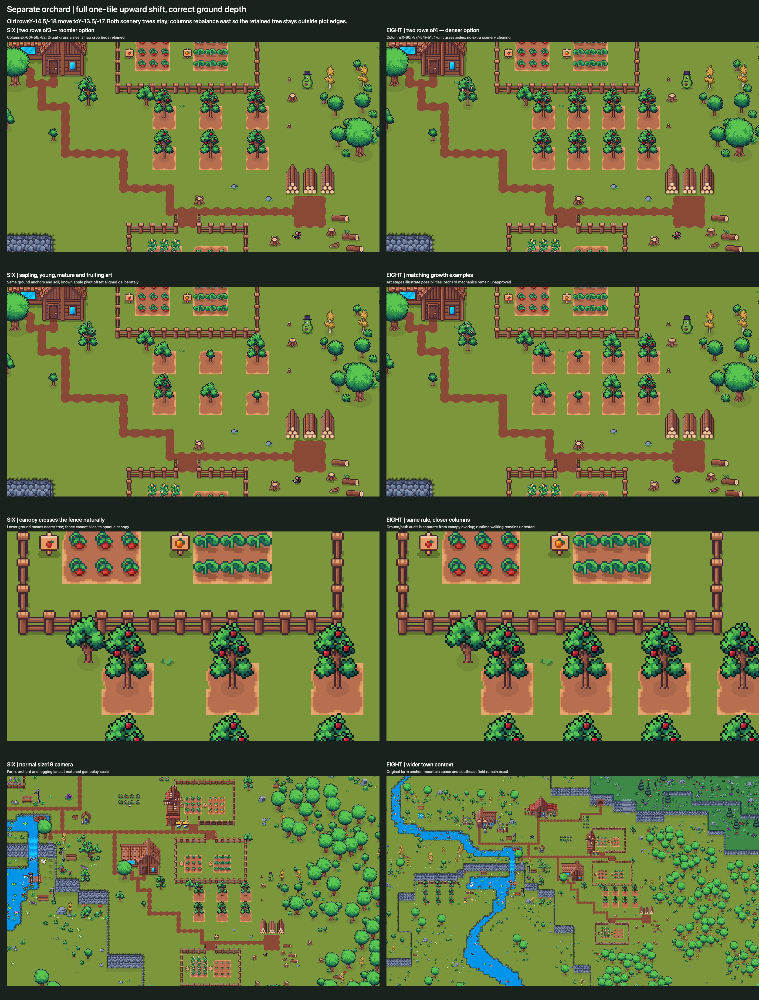
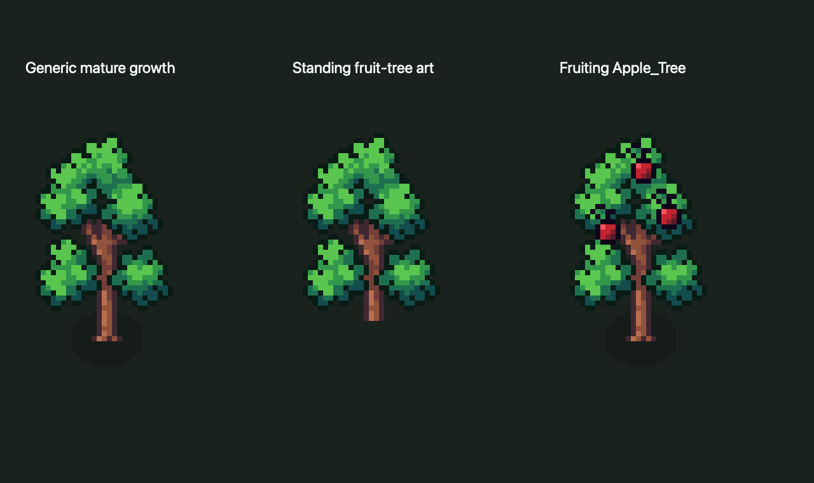
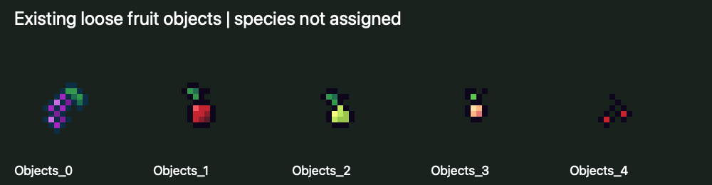

# Orchard: a separate area that unlocks later

Latest user decision, October 2: Orchard must unlock **later** and remain a **separate area**, keeping the crop beds. The approved crop direction, mountain clearance, fences and dual gate paths remain intact. This decision establishes later access, not a level threshold, quest cost, final capacity, fruit economy or NPC XP benefit. The space/art evidence below remains a visual sketch. The user has chosen a Garden/Orchard switch with separate Beds, Progression and Town views; [current desktop designs](../farming-ui-concept-2026-10-02/README.md) keep later Orchard access visible without supplying a threshold.

## Verified art and current game behavior

| Source | Actual imported artwork | What it establishes |
| --- | --- | --- |
| `Crops/Fruit_Tree_Stages.png` | SmallSapling → YoungTree → MatureTree; three32×64 sprites at PPU 16, foot pivot (16,16) | Usable world growth progression with a2×4-world-unit canvas. The generic mature tree has **no fruit**. |
| `Crops/Apple_Tree.png` | Fruiting_WholeTree,32×64 at PPU 16; slightly different foot pivot(16.2522,17.0381) | Existing fruiting apple world art. Align pivots deliberately when changing stage; do not allow a visual hop. |
| `Trees/Big_Fruit_Tree.png`, Medium/Small variants | Standing with/without shadow and stumps | Bare standing tree art and existing cutting presentation, not proof of orchard behavior. Small variant has a different vertical pivot. |
| `Crops/Fruit_Trees_Fruit_Objects.png` | Five generic16×16 loose-fruit sprites | Visible fruit/collectible art exists, but imported names do not assign species or establish multiple species' tree growth sequences. |

The generic mature/standing canopy and apple fruiting art are visually compatible candidates for a bare→fruiting→bare loop. No blossom animation is required by the sketch. Exact stage references/pivots must be reviewed in actual implementation; a stump represents cutting, not ordinary fruit harvest.

There are69 Resource Item assets in the checked-out folder and no Apple/Pear/Peach/Orange/Plum/Cherry resource asset. The existing Medium/Large Tree TaskData use Medium/Large Fruit woodcutting prefabs, but their ResourceDrop entries award **Stick and Log**, not fruit. Fruit-looking scenery does not establish an apple economy, harvest task, unlock, quest demand or Cauldron value. Additional fruit species would need explicit resource/art mapping rather than names inferred from these colors.

[World sprite references](revision-4/seed-tree-art-inventory.json) and [source/UI/resource evidence](revision-4/seed-and-orchard-evidence.json) preserve GUID/localIDs, rectangles, pivots and the resource scan. The audit uses actual current assets; any separately supplied farming icon pack still needs identification.

## Current comparison: full one-tile shift, three or four columns

Both scenery trees remain at their original feet. The old Background layer caused the fence to slice a south-rooted tree; it was a depth defect, not a need to cut down the tree or forbid canopy crossings. The requested full tile shift is retained: rows**Y−13.5/−17**, versus priorY−14.5/−18.

| Visual measure | Six: two rows of3 | Eight: two rows of4 |
| --- | --- | --- |
| Current column anchors | −60/−56/−52 | −60/−57/−54/−51 |
| Spacing / grass aisle | 4 /2 units | 3 /1 units |
|2 × 2 soil plot envelope | 10×5.5 units | 11×5.5 units |
| Row spacing / soil gap | 3.5 /1.5 | 3.5 /1.5 |
| Soil/path or retained base/shadow overlaps | 0 | 0 |
| Extra scenery clearing | 0 | 0 |

Column rebalance east is a provisional visual adjustment around the retained south tree's root/plot boundary; shadow overlap alone would not prove the former position blocks walking. Canopies may project over fences, grass and other silhouettes. Ground sort anchors interleave trees with fences instead of assigning all trees an unconditional foreground layer. Both mature and mixed-stage views show the actual result. Six is preferred provisionally for wider aisles; eight is a viable denser space option. Neither approves orchard yields, costs or final capacity.

All six crop beds,60 crop renderers,150 original path cells, proper corners/gates, dual approaches, original farmers/windmill and mountain relationship are preserved. A checked one-unit grass approach reaches the logging lane; runtime navigation and interaction collision are untested. Stage2 reclaims 23 stumps. A's southeast field clears20 of 28 local standing renderers. Neither operation gains extra tree removal from this depth correction.

[Corrected cause, pixel proof, placement details and preservation](depth-sorting-correction/README.md), [six-tree close](visuals/depth-sorting-correction/G6-one-tile-up-orchard-close.png), [eight-tree close](visuals/depth-sorting-correction/H8-one-tile-up-orchard-close.png) and [current comparison](visuals/farm-optional-orchard.png) are the current evidence. G6/H8-one-tile-up and G6/H8-mixed-up scenes remain separate previews. The previous setback/failed-fit assertions are superseded; archived images/source remain available for comparison.

## Bounded future choices

| Option | Benefit | Cost/risk |
| --- | --- | --- |
| Sequence orchard after the initial crop garden | Matches the user's later-unlock decision; prove the crop foundation first | Exact position relative to the four/six-bed stages is still undecided. |
| Separate decorative orchard rows | Town growth without losing crop beds | Needs reviewed access/material costs and presentation; no fruit collection feature. |
| Separate productive apple orchard rows | Longer-lived trees and a new collection/adventure goal | Adds fruit resources/sinks, acquisition/care rules, tree/batch records, UI, quest/localization and migration/testing. No multi-species promise. |

For a future productive orchard, recommend a permanent planted tree with **one finite fruiting batch per adventure-earned input**, followed by one harvest and a stable bare tree. The exact input is undecided; no care-pack/fertilizer currency, sapling drop rule, rate or fruit yield is approved. A one-time sapling producing free repeated fruit would bring back passive generation. Tree ownership and each fruiting batch would require separate identities and the same proposed exactly-once town-command coordinator as crops. Cutting/stumps are removal states, not normal fruit harvest.

The remaining decisions are where its later unlock sits, how it shares the farmers' interface, whether the first version is decorative or productive and—if productive—what fruit is useful for beyond stew and which adventure action funds each batch. Keep the crop slots; orchard output must be modeled separately from crop-capacity tables. The earlier question of whether to offer later Orchard access is superseded by the user's decision. No orchard gameplay, new fruit resource, commit or release was made.

## Source-location clarification

The checked-out pack actually used for prepared seed packets and saplings is `Assets/Art/Packs/Cute_Fantasy/Crops` (`Crops.png`, `Crops_2.png`, `Fruit_Tree_Stages.png`). It is identified; a separate purchased farming pack was not established. Additional timber candidates are documented in the [read-only recheck](../../development/farming-radish-slice-2026-10-01/tree-tier-proposal/recheck/README.md). Review these before requesting a source upload or new wood art.
