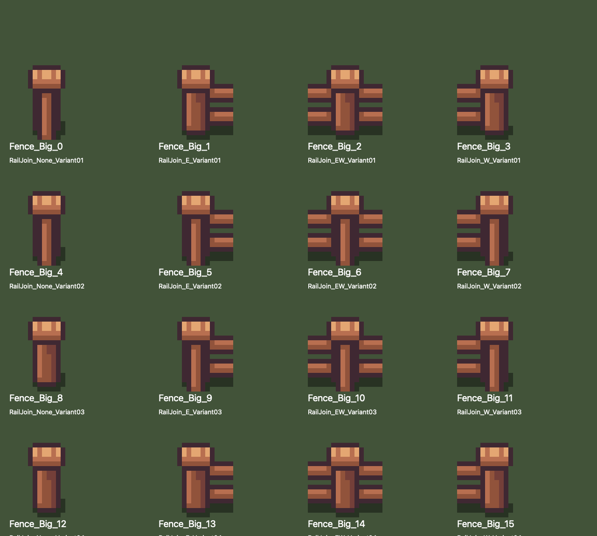
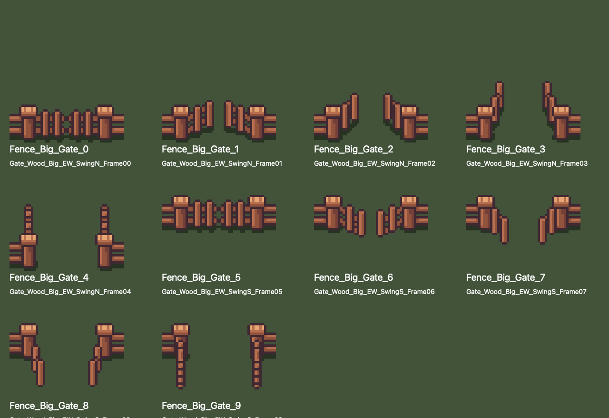
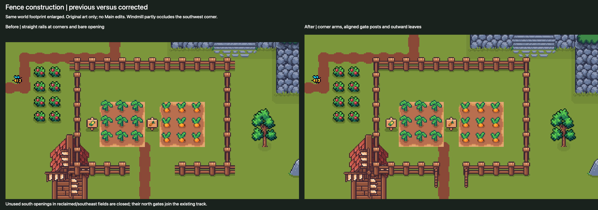

# Fence assembly from actual art

The audited terrain catalogue already assigns stable semantic names/GUID/localID to these sprites. Its E/W connection names describe horizontal arms, while post variants also determine continuation and termination. A **small assembly catalogue supplement is needed** for builders; another mass rename or slice change is unnecessary.

Main supplies the reference: upper-left E Variant02 at(−64,10), upper-right W Variant02 at(−54,10), side None Variant02 runs, lower-right W Variant04 at(−54,−1), and a horizontal gate at(−61,−0.5). Preview assembly uses these established roles and the corresponding lower-left E arm. Exact source identifiers and atlas rectangles are in [fence-assembly.json](fence-assembly.json).

| Assembly role | Imported sprite suffix | Placement rule |
| --- | --- | --- |
| NW corner | RailJoin_E_Variant02 | East arm joins top rail; post continues south. |
| NE corner | RailJoin_W_Variant02 | West arm joins top rail; post continues south. |
| SW corner | RailJoin_E_Variant04 | East arm joins bottom rail; post ends. |
| SE corner | RailJoin_W_Variant04 | West arm joins bottom rail; post ends. |
| Horizontal interior | RailJoin_EW_Variant01 | One-world-unit spacing; omit corner/gate cells. |
| Vertical interior | RailJoin_None_Variant02 | One-world-unit spacing between corners. |
| North gate | Gate_Wood_Big_EW_SwingN_Frame04 | Open leaves point outward north; pivot Y=fenceY+0.5. |
| South gate | Gate_Wood_Big_EW_SwingS_Frame09 | Open leaves point outward south; pivot Y=fenceY−0.5. |

A gate replaces three horizontal fence cells centered on its entrance. Its artwork contains both end posts and external rail stubs: retain adjacent straight rails, omit duplicate end posts, and check the rail baseline. The two frame rows have different post positions within their48×32 rectangles. Sharing their pivot offset visibly detaches the south gate; the final render corrects it.

Each proposed enclosure has one connected entrance: field1 south, fields2/3 north. Unused southern openings are closed. The rectangles are separate and do not require T/X junctions. No crossing is hidden by overlapping straight rail sprites. A future adjoining/crossing enclosure would need its own visually audited junction recipe; horizontal E/W names alone must not be advertised as complete N/E/S/W fence topology.

The six constructed/work preview scenes contain14 enclosures with56 explicit corner pieces and14 actual gate assemblies. Counts corroborate the selection. Acceptance also included visual inspection of the first field close-up, A/B/C enlarged southern views, progression, town context and normal camera views. No outward rail protrudes at the perimeter corners; gate stubs join the adjacent rails; entrances remain clear. Windmill art partly occludes the first southwest corner, as shown openly in the close-up. Runtime hit areas/collision/navigation are still future implementation checks.

Source scenes are separate at `Assets/Editor/FarmingPreviewsV3`. Main, original previews and revision2 previews remain unchanged; the live generator is removed after capture.
