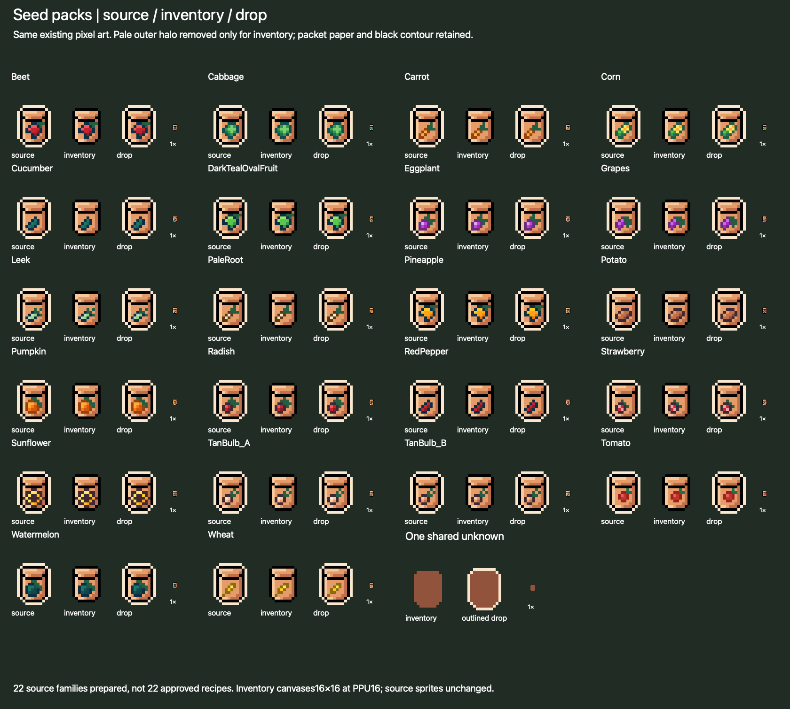

# Fresh seed discoveries and the shared unknown icon

The user has decided seed packs are **new discoveries for everyone**, including legacy players. Old crop unlocks do not reveal or grant them. Seed packs come from new-version plant drop pools; the earlier starter grant and guaranteed work/token proposals are withdrawn. Drop odds, matching/global selection, hero/Echo eligibility and precise recipe access still need review.

## Discovery and persistence contract

Recommend separate stable pack IDs with `quantity` and cumulative committed `lifetimeAcquired` fields. Derive `discovered = lifetimeAcquired > 0`; do not persist an additional discovery/unlock cache. Initialize all 17 planned packs with both quantities zero for both fresh saves and upgraded legacy saves. Do not infer pack discovery from old ResourceInventory.Earned, totalReceived, Farming levels, crop quests or resource cards. A level 90 legacy player still starts with every pack undiscovered.

The first durably committed new-version positive pack reward increments quantity and lifetimeAcquired with its reward identity; the derived discovery changes in that same transaction. Later planting can spend the final pack without hiding it again. Return, death, abandonment, reload and subsequent migrations preserve committed discovery; duplicate callbacks cannot reroll or reveal twice. Existing new-version seed records are retained rather than reinitialized. Cumulative acquired packs are meaningful earned collection history, distinct from a redundant eligibility/unlock cache; inventory quantity alone cannot preserve discovery after all packs are spent. A failed pre-commit reward leaves the unknown state; a committed reward recovered after a crash is known exactly once.

Everyone evaluates the same new game-defined requirements; old crop access is not grandfathered. Recommend computing recipe access from its canonical plant TaskData/current level and quest requirements plus new pack discovery. Do not save a second recipe-unlocked bit. The exact new requirement table remains content review. Until discovery, use an unknown packet slot, “Undiscovered”/“???” and a generic plant-drop hint; do not leak its crop name/icon in tooltip, selection, recipe list or level-lock text. After discovery, reveal the actual name/icon and level requirement. A zero-seed player can complete level 1 Radish adventure plants until a usable pack drops; the farm can wait while the rest of the game continues. Random drops provide no finite wait guarantee.

## Actual packet shapes

The inspected `Assets/Art/Packs/Cute_Fantasy/Crops/Crops.png` contains22 imported colored packet sprites. Tight alpha-mask comparison finds **one identical12×15-pixel visible silhouette across all 22**, so the user's proposed shared unknown packet is coherent. Twenty-one imported rectangles are16×32, while Wheat is16×16; the difference is transparent padding, not a different visible packet. [Pixel/alpha evidence](revision-4/seed-packet-shapes.json) preserves every rectangle, opaque bounds and mask.

The packet names/art include existing crop families plus extras. There was no authored unknown packet among the source sprites. The authorized [icon preparation](seed-icon-preparation.md) now supplies one shared unknown and22 derived borderless inventory variants; there is still no Seed Resource gameplay asset. This does not approve22 recipes: the current crop plan is17 resources, and mismatches such as Radish/eggplant must be resolved explicitly. The prepared UI sprites use equal16×16 canvases without reslicing or changing the source sprite GUID/localIDs. Blind ScaleToFit of the original16×32 sprites into the inventory's18×17 slot would shrink their visible packets relative to Wheat.

## Existing unknown-resource convention

| Existing implementation | Verified behavior | Seed recommendation |
| --- | --- | --- |
| [Resource](../../../Assets/Scripts/Upgrades/Resource.cs) and [ResourceManager](../../../Assets/Scripts/Upgrades/ResourceManager.cs) | Separate `icon`/`UnknownIcon`; positive Add marks unlocked; saved Earned preserves discovery independently of amount | Reuse presentation conventions with **new seed discovery state**, not legacy crop Earned. |
| [Toolkit inventory](../../../Assets/Scripts/UI/Toolkit/ToolkitResourceInventoryScreen.cs) and [UGUI inventory](../../../Assets/Scripts/Upgrades/ResourceInventoryUI.cs) | `IsUnlocked ? icon : UnknownIcon`; unknown tooltip/name; no automatic tint/silhouette fallback | One explicit shared unknown packet Sprite in a reviewed content slice, or a deliberate seed presenter drawing one tinted common template. |
| [Statistics journal](../../../Assets/Scripts/UI/Toolkit/ToolkitStatisticsJournal.cs) | Unknown image hidden, label “?”, tooltip “Undiscovered” | Already supports a consistent unknown treatment without new art, if chosen for that view. |
| Eight Core Resource assets | All share Cores_8, GUID `9a7553022bc32ea4cab234021aded58a`, localID90599415: a flat brown silhouette | One common brown packet silhouette would match this convention. Other chunks/ingots use their own unknown sprites; do not generalize that all ores share one. |

**Prepared shared asset:** `SeedPack_Unknown` uses the common borderless packet alpha mask and existing Core-unknown brown. It can be assigned explicitly by the future seed presenter. The current stock inventory has no runtime tint fallback; a null UnknownIcon still produces no icon. All22 normalized known variants and the shared unknown now render in isolated native inventory controls. TMP/TextCore drop glyphs are appended without moving old indices. [Preparation and rendering evidence](seed-icon-preparation.md) records what is tested and the remaining Player/content integration work.

The evidence applies to the actual checked-out Cute_Fantasy sheets. A separately mentioned “new farming icon pack” was not identified as a distinct local asset source; if it is a different upload/package, its path is needed before claiming it contains usable orchard world art. This does not block the verified checkout audit.

## Focused acceptance fixtures

- Fully discovered legacy17-crop/level 90 history and partial/fresh history each initialize17 zero/undiscovered pack records.
- Old crop/card/quest metadata cannot reveal any new pack name/icon through inventory, recipes, tooltips or selection.
- Forced first eligible plant-pack outcome atomically persists the correct pack quantity, discovery and reward identity; inject failures before/after commit/publication.
- Spending the last pack leaves lifetimeAcquired positive and derived discovery true across reload and the next data-version upgrade.
- All 22 audited glyphs have equal visible size in the contact evidence; the 17 approved icons and one unknown variant remain readable in actual UI at 1024 width/high DPI/keyboard selection.

[Seed and UI source hashes](revision-4/seed-and-orchard-evidence.json) and [crop mapping inventory](crop-asset-inventory.json) retain the supporting references. No gameplay Seed Resource or live discovery UI was added; derived art and the two existing text atlas tables were prepared in the subsequent authorized asset slice.

## Requirements and legacy discard decision

Actual `TaskWeightService.IsTaskUnlocked` reads `TaskData.associatedSkill/requiredSkillLevel` and `SkillController.GetProgress(...).Level`; it does not need a per-save crop unlock flag. The 17 TaskData level requirements and ResourceUnlockConfig presentation entries match. [Audited requirements](revision-4/requirements-evidence.json) provide exact assets/levels. A proposed farm recipe references this canonical task definition rather than copying a second level table.

User decision: retain actual skill levels/XP, discard obsolete unlock data and purchased old stat upgrades, and make no starter-gear conversion. Do not label every Earned field, quest record or upgrade-like field obsolete based on its name; the separate migration audit identifies precise released-format fields. Preserve meaningful quest/material history and evaluate current authored criteria equally for everyone. Retained level 90 can naturally satisfy current level requirements; it never bypasses new prerequisites or fresh seed discovery. Initial new pack discovery remains false even when retained levels meet every skill gate.

## Source-location clarification

The checked-out pack actually used for prepared seed packets and saplings is `Assets/Art/Packs/Cute_Fantasy/Crops` (`Crops.png`, `Crops_2.png`, `Fruit_Tree_Stages.png`). It is identified; a separate purchased farming pack was not established. Additional timber candidates are documented in the [read-only recheck](../../development/farming-radish-slice-2026-10-01/tree-tier-proposal/recheck/README.md). Review these before requesting a source upload or new wood art.
