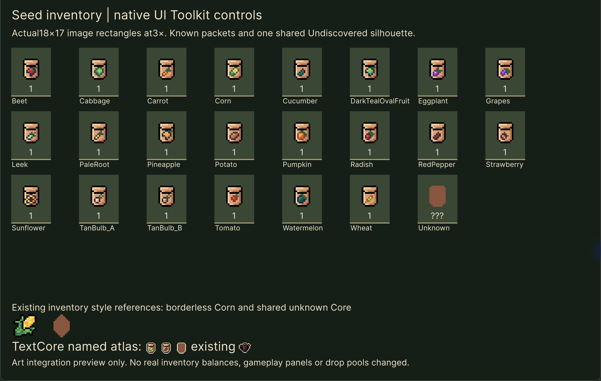
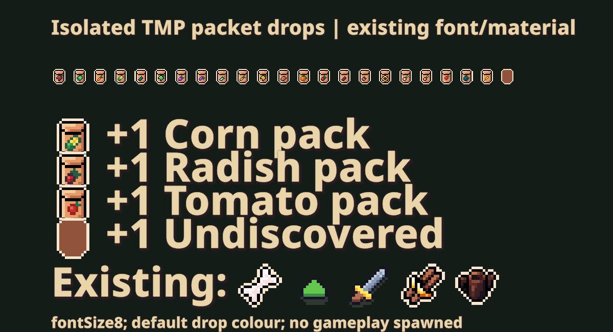

# Seed-pack art prepared — 1 October 2026

The authorized icon work is complete:22 borderless inventory packets, one common unearned packet, and23 new outlined drop glyphs. This prepares existing art for future seed content; it adds no seed Resource, drop probability, farming behavior or save fields. The approved V4 crop layout remains unchanged.

## Border decision and shared unknown

Existing Corn/crop inventory assets use `Food_Icons_NO_Outline.png`; floating resource text uses an outlined atlas. The packet source has a pale `#F9E6CF` outer halo outside its black contour. Remove that40-pixel common perimeter for inventory only. Preserve the black contour, pale `#F6CA9F` packet paper/fold, printed crop and every other interior pixel. Three interior pixels across the known packets also use the halo colour: a colour-wide deletion would damage the art, so the authoring operation uses the verified common perimeter coordinates instead.

All22 borderless packets have the same alpha mask and16×16 canvas, including Wheat. The shared unknown uses that same silhouette with flat `#91533B`, the actual existing Core unknown colour. Its drop variant retains the outer halo for world-text contrast. The underlying Crops.png and its metadata are unchanged; all original32-pixel-height packet references remain valid.

## Assets and safe atlas extension

| Asset | Result |
| --- | --- |
| [SeedPackInventory.png](../../../Assets/Art/Derived/SeedPacks/SeedPackInventory.png) | New128×48 sheet:22 named `SeedPack_{family}` sprites plus `SeedPack_Unknown`;16×16 rectangles, PPU16, centre pivot(8,8). |
| [FloatingTextIcons.png](../../../Assets/Resources/Fonts/FloatingTextIcons.png) | Extended288×192→288×224 by adding two rows **above** the original image. All55,296 original RGBA pixels and original sprite rectangles stay at the same coordinates. |
| [TMP sprite asset](../../../Assets/Resources/Fonts/FloatingTextIcons.asset) | Appends glyph/character indices213–235; all213 existing definitions and their references stay exact. New content can use `<sprite name="SeedPack_Corn">`, avoiding new hard-coded numeric dependencies. |
| [Native inline sprite asset](../../../Assets/UI/Toolkit/InlineSprites.asset) | Same23 appended entries so UI Toolkit and TMP share the atlas. Existing material and default text-settings references remain unchanged. |

Both textures import as uncompressed RGBA32, Point filtering, no mipmaps, Clamp wrapping and alpha transparency. Existing texture/asset GUIDs, local sprite fileIDs, glyph metrics and old0–212 ordering are preserved. No destructive grid reslice or atlas repack was used. The separate terrain SpriteAtlasV2 is not the floating-text atlas and was left unchanged.

[Exact names, GUIDs, fileIDs and rectangles](seed-icon-preparation/asset-manifest.json) provide the future content-binding reference. These are22 **art families**, not22 approved recipes. Ambiguous current crop/art mappings still require explicit content decisions; no mappings were inferred or wired into gameplay.

## Verified rendering and consumers

The isolated native UI Toolkit preview renders all23 imported sprites using the inventory's actual18×17 `ScaleToFit` icon rectangle at3× for review. It includes existing borderless Corn and shared Core unknown references. TextCore renders Corn, Radish, shared unknown and an old Farming glyph using a temporary Resources alias cloned from InlineSprites; the alias is removed afterwards. This is an isolated art presentation, not a live seed inventory or discovery test.

On Mac Metal, TMP resolves all23 new named characters and emits visible sprite vertices. The render uses the existing font, sprite material, fontSize8 and actual `FloatingText.DefaultColor`, plus old resource/stat/skill indices56,192,198,207,211. Both text assets import236 characters/glyphs with valid sprite references. Validation recorded no runtime/Editor warnings or errors during the successful render pass. The initial detached Edit-mode runtime panel never laid out; its blank capture is retained privately as a failed attempt. The native preview replaces it. A full Player/mobile UI test remains for the content implementation slice.

The [consumer audit](seed-icon-preparation/consumer-audit.json) covers20 serialized consumers and27 source consumers: ResourceIconLookup, StatIconLookup, SkillIconLookup, FloatingText, task reward text, quests, pinned text, gear/forge/skill/run screens, default TMP settings and the native TextCore mirror. Their source and serialized references remain unchanged except the explicitly appended atlas tables. No new resourceID-to-index routing was added. Future typed seed rewards must bind the prepared names explicitly and must not inherit the ordinary resource bonus path accidentally.

The existing ResourceEditor unknown-icon menu uses a stale `Assets/Fonts` path and assigns across Resources; it was not run. ToolkitBookMigration clears/rebuilds native glyph tables from TMP; it was not run. Future authoring should append entries to both tables, preserve each existing spriteID/fileID, keep old pixel coordinates and retain the recorded names. The included execution scripts are evidence tied to saved baselines, **not an automatic rebuild command**; blindly rerunning the metadata script would create a new inventory GUID.

[Pixel checks](seed-icon-preparation/pixel-verification.json), [Unity import/render checks](seed-icon-preparation/unity-verification.json) and [final preservation checks](seed-icon-preparation/verification.json) retain exact evidence. Temporary preview helpers/aliases are removed, Main and real saves preserved, and no commit/push/release was made.
