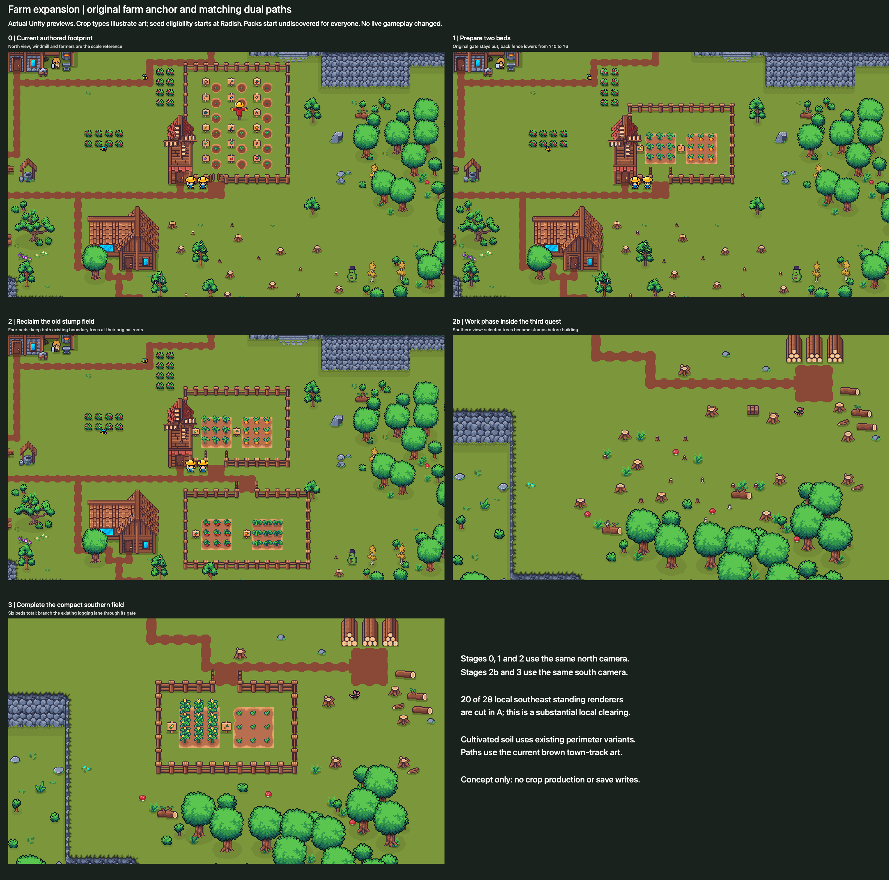
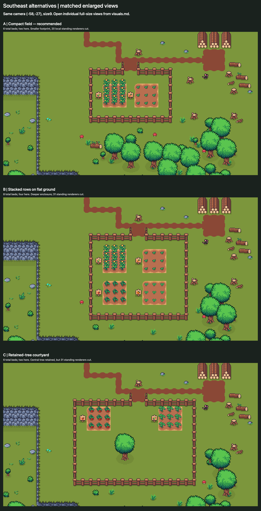
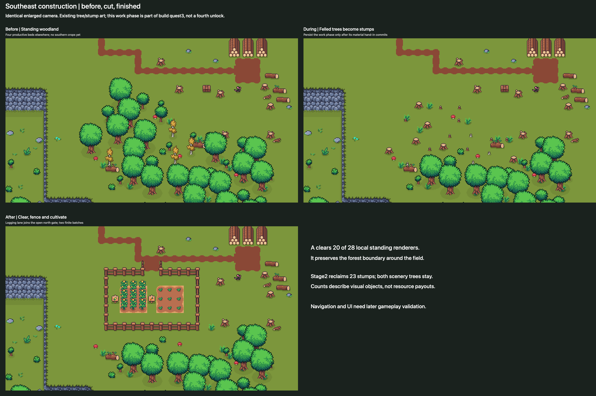
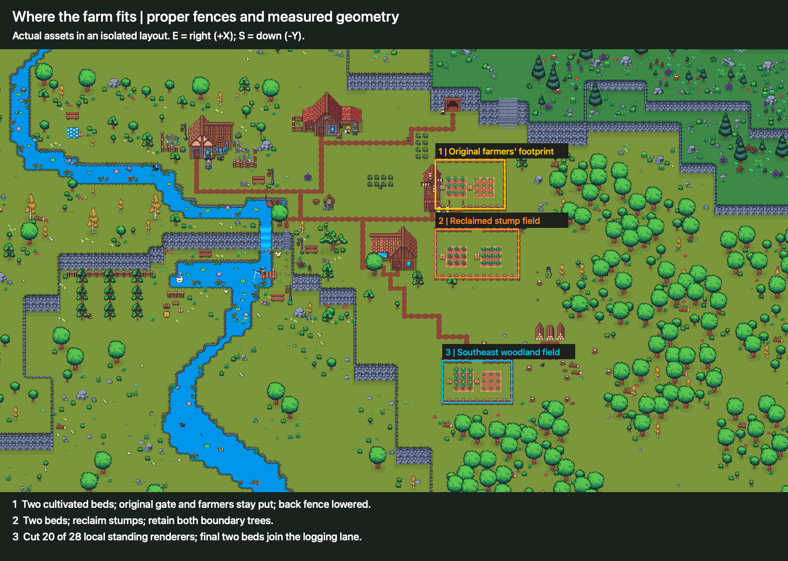
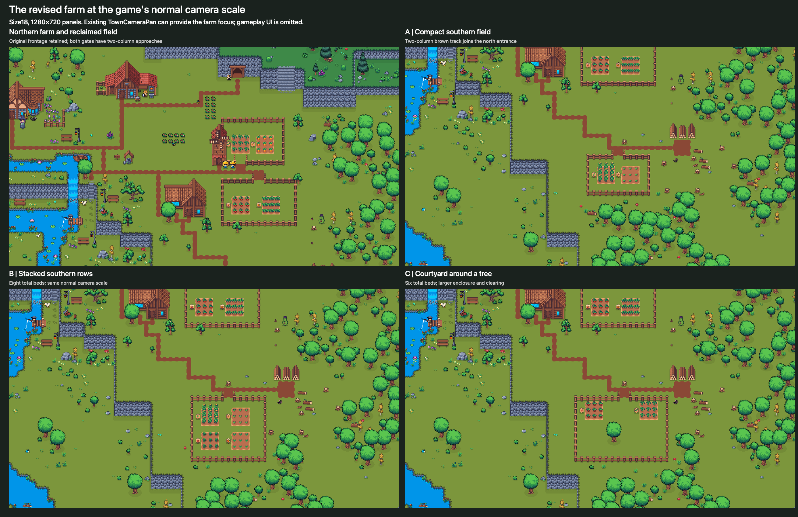
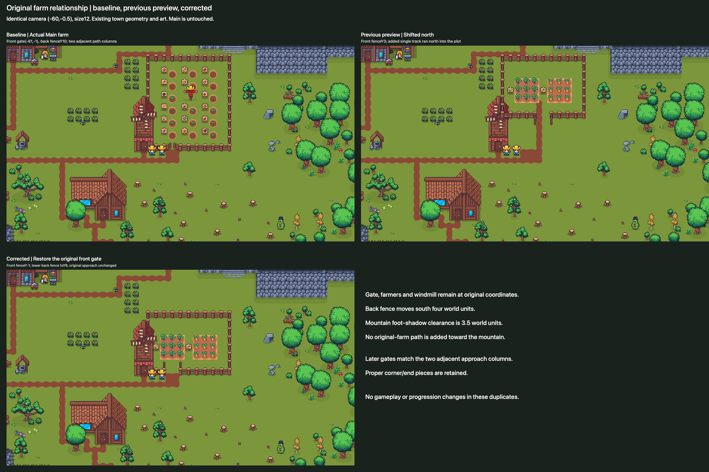
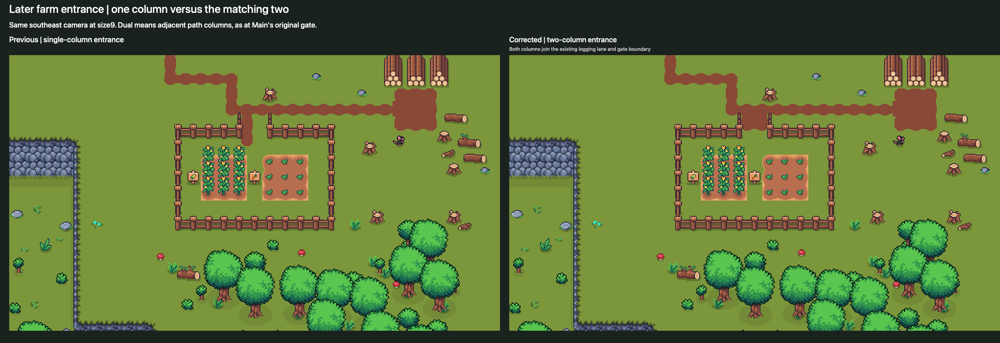
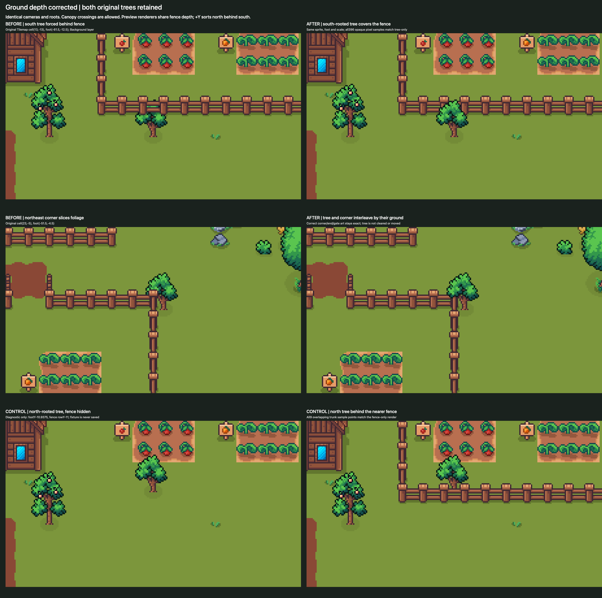

# Revised staged farm previews

These are actual Unity Edit-mode renders of isolated town duplicates using existing imported assets. Main is preserved. Gameplay scripts are removed from duplicates; no production, progression or save selection runs. Current figures are revision4. Revision3 scenes, images and documents remain archived with hashes. Revision2 scenes, images and documents remain archived with hashes. The earlier peach-path version remains archived with hashes, original scenes, all 28 renders and documents for review comparison.

## Progression and cultivated plots

Matched north close views show the authored footprint, first two cultivated beds and reclaimed stump field. Matched south close views show the work phase and completed compact field. One three-by-three bed represents a finite paid batch, not nine independent plots. Corn, Carrot, Tomato and Pumpkin illustrate verified art, not tutorial eligibility; Radish eligibility starts at level 1 and requires an approved art mapping.

Stage2b is an intermediate work phase **inside the third build quest**: material hand-in durably records marked/felled state, selected trees become stumps, and the player sees construction underway during the next adventure. A further bounded quest objective/return completes stump clearance, fences and soil, unlocking the final two beds. Persist the work phase so load/reload cannot instantly skip or repeat it; allow completion on the next meaningful return without a real-time attendance deadline. It is not a fourth quest or extra productive stage. Imported tree/stump art already supports this presentation; no cutting animation is promised without an animation audit.

## Matching paths and real gates

Main's active thin brown town track uses **Farmland_WetOverlay** variants. Revision2 edits that tilemap only in the duplicate, selecting cardinal joins and absent diagonal corners from audited assets. It removes the broad mismatched peach overlay. Soil uses **Farmland_DryTanBorder** perimeter/corner variants. Small ground props inside or touching preview fences are cleared only in the duplicates; the compact/stacked top beds shift south to keep mature plants away from the gate silhouette.

| Field | Actual preview entrance | Connection |
| --- | --- | --- |
| Original footprint | Original south gate centered(−61,−1) | Preserve adjacent columnsX−62/−61; lower north fenceY10→6 |
| Reclaimed field | North gate centered(−58,−4) | Two adjacent columnsX−59/−58 from the adjoining northern lane |
| Compact southeast | North gate centered(−58,−23) | Two adjacent columnsX−59/−58 join existing logging lane atY−22 |
| Stacked/courtyard southeast | North gate centered(−57,−23) | Two adjacent columnsX−58/−57 from the same logging lane |

All 14 gate checks and28 adjacent-column route checks across the six built/work preview scenes pass tile-route flood connectivity and fence-aperture checks. [Revision4 verification](revision-4/verification.json) records current route checks; [revision2 evidence](revision-2/terrain-and-gate-evidence.json) retains the original Main path-cell audit. These are static visual connectivity checks, not gameplay pathfinding/collider validation. Production must match whichever of the seven town-path presentations is active, verify walking/hit clearance and include actual UI.

## Larger matched alternatives

All three south close views use the same1600×900 camera at(−58,−27), orthographic size 9. Each comparison panel retains the full render width, stacked for readable inspection rather than squeezing three town-wide shots side by side. Open an individual view for the largest practical comparison:

- [A: compact six-bed layout](visuals/revision-4/A3-southeast-clearing-south-close.png)
- [B: stacked eight-bed layout](visuals/revision-4/B3-terraced-rows-south-close.png)
- [C: six-bed courtyard around a retained tree](visuals/revision-4/C3-grove-courtyard-south-close.png)

| Alternative | Footprint and clearing | Trade-off |
| --- | --- | --- |
| A: compact | Final two beds insideX−63..−53/Y−29..−23; cuts 20 of 28 local southeast standing renderers | Recommended smaller endpoint; substantial local clearing with readable surrounding woodland boundary. |
| B: stacked rows | Final four beds insideX−63..−51/Y−33..−23; cuts 31 in the larger area | Eight total beds, more reserve capacity and clearing; flat ground, not raised terraces. |
| C: courtyard | Final two beds insideX−65..−50/Y−33..−23; cuts 31, retaining one interior tree | Six total beds; stronger garden character but more clearing and footprint than A. |

Each also reclaims23 old stump renderer objects farther north and now removes two decorative young-tree tiles crossing field2 boundary fences. Renderer counts are visual objects, not authored resource payouts. “Most woodland retained” globally does not make A's 20 of 28 local changes minor. Surrounding canopy boundaries and the logging area remain legible; no Main tree was removed.

## Wider town and normal camera scale

Main's unrotated camera establishes east/right and south/down. Most of the older field is already felled; two decorative young-tree tiles at its future fence edges also need clearing. Standing woodland lies farther south/east. Wider size 32 is an Editor overview solely for town composition.

Normal panels are1280×720 at size 18, panned north and south. The full vertical expansion does not fit the unchanged default framing. TownCameraPan already supports bounded panning and size 9..27 zoom; propose a small farm/bed focus API and a readable bed list instead of requiring tiny world clicks. Close comparison size 9 matches the current minimum; north close size 12 includes both northern fields. Actual UI, animation, keyboard/list accessibility and screen-reader behavior are not validated by these Edit-mode renders.

## Recoverable sources and version trace

- Current isolated scenes: `Assets/Editor/FarmingPreviewsV4`, seven distinct scene assets outside Loading/Main build settings.
- Original scenes remain at `Assets/Editor/FarmingPreviews`; their bytes are unchanged.
- Original evidence archive: `/Users/matthewrushworth/Projects/Echoes Farming Planning Evidence/2026-09-30/revision-1-archive/`,63 files with hash manifest.
- Revision2 raw42camera renders and path audit: `/Users/matthewrushworth/Projects/Echoes Farming Planning Evidence/2026-09-30/revision-2/`.
- [Current generator text](revision-4/preview-generator.cs.txt), [figure source](visuals/revision-4/compose-figures.swift), [clearing manifest](revision-4/preview-manifest.json) and [revision notes](revision-4/README.md) preserve reproducibility without a live Editor worker.
- [Library delivery](library-delivery.json) records the five image identities. Current images replace the same Library files, retaining original versions. Local originals remain in the archive.

Independent read-only review identified the original path/gate defect and a remaining stump/fence overlap in B. Revision2 removes that overlap using renderer bounds and shifts mature entrance crops south; final review and preservation checks are recorded in revision2 evidence.

## Fence correction, revision3

The previous generator repeated EW straight rails at all corners and omitted gate sprites. Revision3 uses Main's authored upper E/W corner variants, lower terminated E/W corner variants and vertical post runs. The gate artwork includes end posts and outward-swinging leaves; north frames need+0.5Y and south frames−0.5Y to join the rails. Each enclosure has one connected gate; unused southern holes in fields2/3 are closed. No rectangles intersect, so no T/X junction is needed. Outer corners have no outward protruding horizontal rail. Main's existing fence remains the reference and is untouched.

A focused [fence assembly guide](revision-3/fence-assembly.md) supplements the terrain catalogue: horizontal semantic names alone do not describe post continuation, corner placement or gate pivots. No asset renaming, reslicing or production fence code was changed. Four corners per enclosure and real gate end assemblies were checked in enlarged and normal rendered views, not only by counts. Windmill art partly occludes the first southwest corner; its fence piece is assembled correctly and the existing approach remains visible. Runtime colliders/hit areas remain implementation validation.

Seven new isolated scenes and49 raw renders are retained in the private revision3 evidence directory. [Generator](revision-3/preview-generator.cs.txt), [manifest](revision-3/preview-manifest.json), [review and preservation evidence](revision-3/README.md) and [figure source](visuals/revision-3/compose-figures.swift) preserve reproduction. Revision2 remains unchanged at `Assets/Editor/FarmingPreviewsV2` and in the private `revision-2-archive`. All five existing Library identities receive the corrected figures; the extra before/after close-up remains a linked local review figure.

## Original farm and dual-path correction, revision4

V4 restores the original south gate(−61,−1), lowers the back fence fromY10 toY6, and keeps original farmers/windmill poses. Beds occupy the lower interior at(−62,1)/(−58,1). Nothing extends the original farm path toward the mountain. Its nearest foot-shadow canvas is3.5 world units beyond the revised fence top; the front face is4.5 units away. No Main camera, fence, tile or actor was edited.

Actual Main establishes that dual means **two adjacent columns**, not two gates or opposite entrances. Both later fields receive that width and connect through their north gates. The second-field branch retouches one existing lane-end join; original approach positions/transforms remain intact. A short unused upper stub was removed after close visual inspection so the track does not terminate against the first field's solid fence. All built/work stages retain proper corners and gates. First-front fence/gate art stays behind the original NPCs; the windmill closes the lower west edge rather than introducing posts over its wall.

Seven V4 scenes and49 current raw renders are retained, with [generator](revision-4/preview-generator.cs.txt), [manifest](revision-4/preview-manifest.json), [reference geometry](revision-4/layout-reference.json), [source/review notes](revision-4/README.md) and [figure source](visuals/revision-4/compose-figures.swift). V3's final125-file package, scenes and49 renders remain privately hash-archived at `revision-3-archive`; all previous versions remain intact.

The current [optional orchard sketch](optional-orchard.md) compares two rows of three or four trees on dedicated orchard dirt plots in a separate strip and keeps every V4 crop bed, path and fence. Its isolated scenes and matched close/wider views replace the older bed-substitution recommendation; that old source remains historical. Orchard gameplay is unapproved. [Seed icon evidence](seed-icon-preparation.md) includes before/after art and actual isolated Unity rendering. The five approved V4 crop figures and current orchard image retain their Library identities, with corrected scenery versions. Prior render versions remain archived.

## Ground-depth correction

Both original scenery trees remain at the same feet. Their Background layer forced them behind fences; current preview representations share Default/order3 and sort by ground. All396 south-tree opaque samples and9 north trunk/fence overlap samples have the correct draw order. Canopies may cross the fence. Stage2 still reclaims23 stumps, with no additional tree clearing.

[Full correction, actual material/layer evidence, ground checks and source preservation](depth-sorting-correction/README.md) includes matched enlarged, normal-camera and wider town views. The separate six/eight orchard retains the full one-tile shift; all2,046 visible mature-tree opaque samples pass the fence-hidden control comparison. Previous failed-fit/setback and two-tree-removal recommendations are superseded; their evidence remains archived. The five crop figures, orchard comparison and before/after figure keep their Library identities with corrected versions. Seed icon figures remain unchanged.
