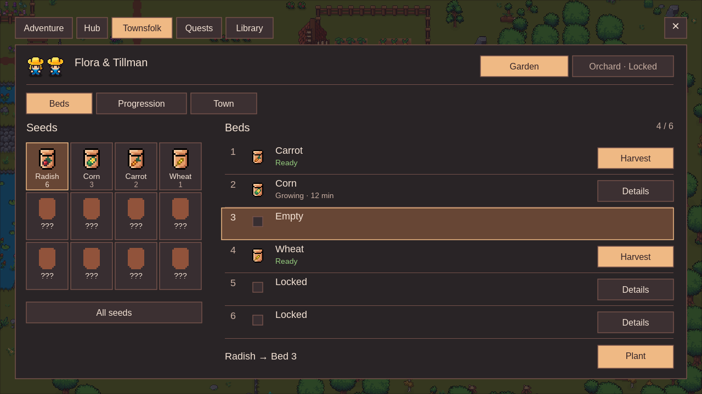
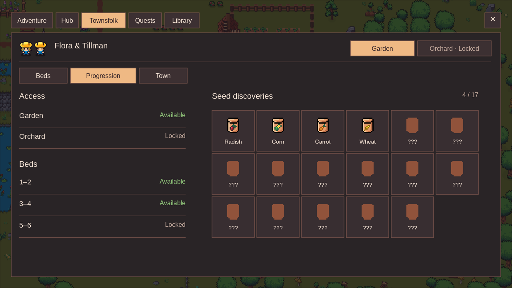
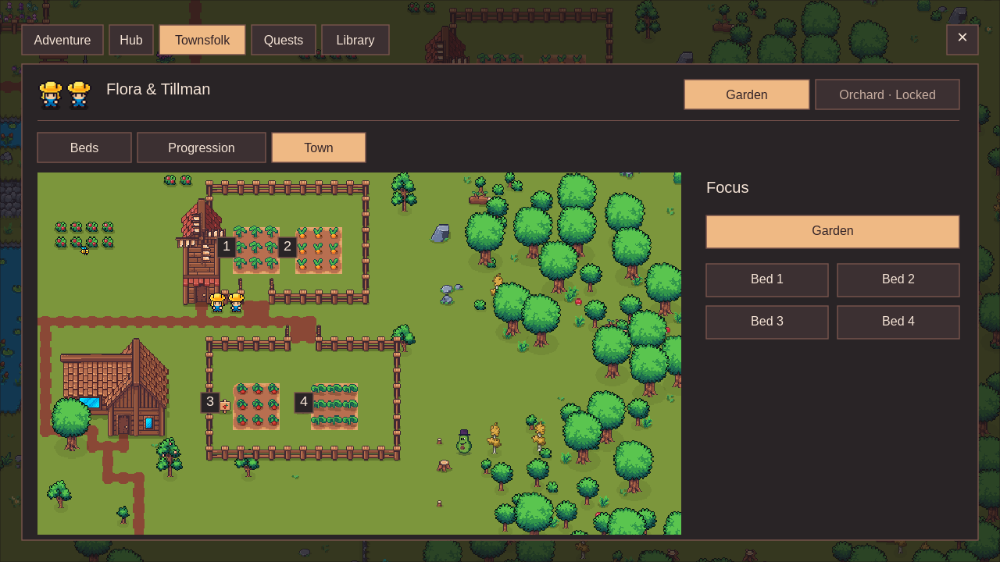

# Garden / Orchard desktop workspace

The current concept uses the preferred first desktop style, a Garden/Orchard switch and three separate views. Orchard is visibly locked for later access. Its threshold and the twins' level benefits remain undecided; no numeric NPC level/XP is shown.

| View | PNG | Editable source |
| --- | --- | --- |
| Beds | [Garden-Beds-desktop.png](Garden-Beds-desktop.png) | [Tesseract](Garden-Beds-desktop.tsrct) |
| Progression | [Garden-Progression-desktop.png](Garden-Progression-desktop.png) | [Tesseract](Garden-Progression-desktop.tsrct) |
| Town | [Garden-Town-desktop.png](Garden-Town-desktop.png) | [Tesseract](Garden-Town-desktop.tsrct) |

All three are 1280 × 720 static designs. Beds handles seed selection and bed actions; Progression shows access, bed groups and seed discoveries; Town shows actual preview geometry and numbered focus targets. Every on-screen string is an item/control, value/state or necessary action. Assumptions stay outside the interfaces.

[Design notes and flow](workspace-notes.md), [shared code/art/decision baseline](workspace-baseline.md), [verification](workspace-verification.json) and [Library delivery](workspace-library-delivery.json) accompany the [portable editable-source package](Echoes-Garden-Orchard-workspace-sources.zip). The package embeds fonts/images in the three native Tesseract projects. Existing Liberation Sans, Flora/Tillman, packet art and V4 town renders are reused. [Font license](assets/LiberationSans-OFL.txt).

The four-open/six-total-bed state, packet counts, 4/17 discoveries and remaining time are illustrative. The paired bed groups are provisional staging, not approved level gates, costs or a quest graph. Orchard's fruit cycle, inputs, capacity and progression are unsettled. Watering, XP and level benefits are not supplied by these screens. Barkley/Gill systems are parked outside this design session.

Previous desktop/narrow/detail and exploratory images remain unchanged under their existing names and Library identities. [Previous notes](desktop-workspace-before/README.md), [narrow border correction](narrow-highlight-verification.json) and [artifact checkpoint](desktop-workspace-before/checkpoint.json) preserve the history. No gameplay, saves, Unity scenes, commit, push or release changed.
