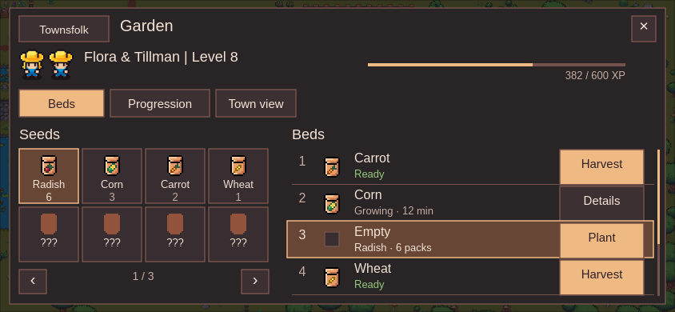

# Farming UI concept — copy revision

The desktop garden, narrow landscape garden and seed/bed detail are revised to use the short labels, values and actions of the existing Forge and Cauldron. The twins’ quote, decorative subtitles, explanatory sentences and mockup disclaimers are removed from these three interfaces. One Plant action commits the selected seed and bed in each view.

| Revised screen | PNG | Editable Tesseract source |
| --- | --- | --- |
| Desktop, 1280 × 720 | [Farm-desktop.png](Farm-desktop.png) | [Farm-desktop.tsrct](Farm-desktop.tsrct) |
| Narrow landscape, 844 × 390 | [Farm-narrow-landscape.png](Farm-narrow-landscape.png) | [Farm-narrow-landscape.tsrct](Farm-narrow-landscape.tsrct) |
| Seed / bed detail, 1280 × 720 | [Farm-seed-and-bed-detail.png](Farm-seed-and-bed-detail.png) | [Farm-seed-and-bed-detail.tsrct](Farm-seed-and-bed-detail.tsrct) |

## Copy and interaction

[Copy audit](copy-audit.md) records removed and retained text. The desktop selects an empty bed row and a packet, then offers one Plant button next to `Radish → Bed 3`. The narrow view offers Plant only in its selected third-bed row. The detail view identifies `Bed 3 · Empty` and Radish, then provides Back and one Plant action. None adds a second competing planting action.

Numbered bed rows identify the garden targets. The desktop garden has larger matching 1–4 markers. Locked beds 5–6 stay in the list; their field is outside this current four-bed garden image. Ready, Growing, Empty and Locked remain because they distinguish actions and explain unavailable beds. Details provides access to the growing or locked bed. Unknown seeds use the existing shared brown packet and `???`; no explanation or hidden crop name is displayed. Packet counts are shown only for discovered packets. The narrow seed grid has page controls and a page value; the bed list retains its scrollbar.

## Assumptions outside the interface

These are static design images, not an implemented UI. All counts, Level 8, 382/600 XP, twelve minutes and bed states are illustrative. The combined twins XP header is an unresolved layout option, not a decision about shared versus separate XP, award timing, thresholds or perks. No watering rule is added to these three views. Pack cost, duration, yield, seed odds and unlock requirements remain the user’s mechanics decisions; the images supply none of those missing values.

Four discovered examples use the current Radish, Corn, Carrot and Wheat task names and matching packet names. The seventeen-slot proposal and unresolved crop/art mappings remain provisional. Everyone discovers seed packs fresh through new-version plant drop pools; old crop access grants no packs, and Alter Echo retirement gives no compensation.

The garden image remains the approved V4 preview geometry. Native number labels improve bed identification; the underlying world crops illustrate existing art and do not encode the list’s crop assignment or growing/empty state. No live town geometry or scene is changed. Focus garden represents the proposed use of existing TownCameraPan, not a working camera control in this artifact.

## References and preservation

The actual [Forge desktop](../../ui-migration/forge-iteration-2026-09-28/forge-review-desktop.png), [Forge narrow layout](../../ui-migration/forge-iteration-2026-09-28/forge-review-phone.png) and [Cauldron](../../ui-migration/controls-review-2026-09-28/1280-cauldron.png) guided the revision. The existing dark surfaces, cream text, peach selection, square controls, short NPC header and thin XP track are retained. Text uses the game’s Liberation Sans, with its [OFL license](assets/LiberationSans-OFL.txt). Existing Flora/Tillman frames, packet icons and garden art are reused; no replacement art was generated.

The previous three screens, editable sources and evidence are preserved under [revision-1-before](revision-1-before/checkpoint.json). The older [progression](Farm-progression.png) and [watering exploration](Farm-watering-exploration.png) are unchanged historical concepts; they are not part of this revised three-screen delivery and do not approve mechanics. Their explanatory interface copy has not yet received this revision.

[Revision verification](revision-1-verification.json) records saved-source rendering, dimensions, text categories, contrast, preserved Main and review limits. [Library delivery](library-delivery.json) records identities and versions; the same three image identities are updated. Tesseract renders offscreen through Metal without Unity or desktop automation. No gameplay, save data, commit, push or release is changed.
