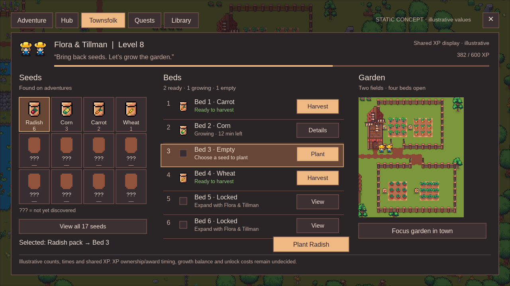
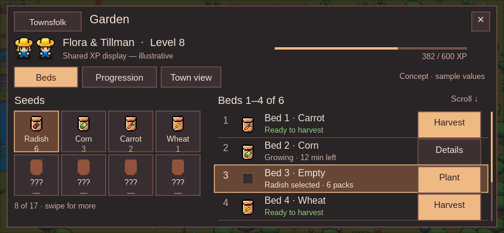
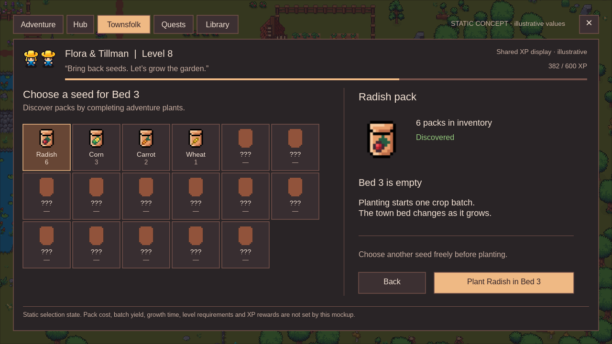

# Farming UI concept

Five newly rendered concept screens put Flora and Tillman, adventure seed discoveries and finite crop beds into the current Echoes interface. The dark surfaces, cream text, peach selections, square controls and thin XP tracks follow the September 28 Forge/Cauldron captures and `Gameplay.uss`. These are editable static designs, not working gameplay screens.

Start with [desktop](Farm-desktop.png), then the [narrow landscape layout](Farm-narrow-landscape.png). The seed selection screen makes the whole proposed seventeen-slot inventory visible. The progression screen shows the approved town layouts becoming two, four and six beds. The watering screen is a separate exploratory alternative.

| Screen | PNG size | Editable source |
| --- | --- | --- |
| [Desktop garden](Farm-desktop.png) | 1280 × 720 | [Farm-desktop.tsrct](Farm-desktop.tsrct) |
| [Narrow landscape garden](Farm-narrow-landscape.png) | 844 × 390 | [Farm-narrow-landscape.tsrct](Farm-narrow-landscape.tsrct) |
| [Seed selection / empty bed](Farm-seed-and-bed-detail.png) | 1280 × 720 | [Farm-seed-and-bed-detail.tsrct](Farm-seed-and-bed-detail.tsrct) |
| [Garden progression](Farm-progression.png) | 1280 × 720 | [Farm-progression.tsrct](Farm-progression.tsrct) |
| [Exploratory watering](Farm-watering-exploration.png) | 1280 × 720 | [Farm-watering-exploration.tsrct](Farm-watering-exploration.tsrct) |

The desktop keeps seeds, bed actions and the town garden together. Selecting Radish and the empty third bed leads to a clear Plant action. Ready, growing, empty and locked beds use written states alongside their visual treatment. The narrow layout reflows into two columns with a compact NPC header and separate progression/town-view tabs; it does not scale down the desktop. It shows eight of seventeen seed slots and four of six bed rows, with explicit paging/scroll affordances. Its bed action targets are 105 × 44 pixels. These affordances are drawn, not interactive.

Unknown slots use the prepared shared brown packet and “???”, without hidden crop names. Only Radish, Corn, Carrot and Wheat are displayed as discovered illustrative examples: each has both a canonical current plant task and a correspondingly named packet asset. This does not settle the remaining crop/art mapping gaps or wire a recipe into gameplay. The bed list deliberately uses packet icons as seed identity rather than silently rebinding the mismatched legacy Radish resource art.

The garden images come from saved, approved V4 Unity previews: first two beds in the original farm, four beds after reclaiming the stump field, then the separate southern addition bringing capacity to six. The first two views use the same north camera and crop; the third shows the southern field with its actual gate/path approach, not all six beds in one camera. The world crops illustrate existing art, not the exact simulated bed assignments in the list. Nothing was moved or constructed in Main for these designs. “Focus garden” represents the intended existing TownCameraPan route, not a newly implemented camera action.

All numeric values are illustrative: Level 8, 382/600 XP, packet counts, twelve minutes remaining, discovered-slot count and current stage. The mockup uses a shared twins XP display as one visual option. **Shared versus separate XP, XP award timing, thresholds and perks are undecided.** The twins own the interface/progression concept as NPC guides, like Ivan and Eva; there are no walking workers or worker assignments.

The watering variant alone shows three illustrative watering stages and a possible auto-watering control. **Whether watering is required or optional, its timings, stage count, auto-watering unlock and speed effect are undecided.** The main screens make no watering commitment. Costs, durations, yields, seed odds, requirements and new balancing rules are not approved by their appearance here. Approved seed policy remains fresh discovery for everyone through new-version plant drop pools, with no old-crop seed grant or Alter Echo compensation.

## Source and verification

Reference captures: [current Forge](../../ui-migration/forge-iteration-2026-09-28/forge-review-desktop.png), [narrow Forge](../../ui-migration/forge-iteration-2026-09-28/forge-review-phone.png) and [current Cauldron](../../ui-migration/controls-review-2026-09-28/1280-cauldron.png). The design uses the actual gameplay Liberation Sans font with its [included OFL license](assets/LiberationSans-OFL.txt), the first authored idle frames of Flora/Tillman, prepared seed sprites and three actual Carrot world growth sprites. Raster extracts are confined to this design folder; all text, controls, panels, XP tracks and layout geometry remain editable native Tesseract layers.

Tesseract 0.3.1 rendered all five saved projects on Apple M3 Max / Metal, without taking control of Safari, Unity or the desktop. The sandbox initially hid GPU adapters; the approved local Metal render resolved that limitation. Every final PNG was opened and inspected at its authored dimensions. The narrow version was reviewed separately for overflow, readable action labels and scroll/paging clarity. Pixel art is extracted with nearest-neighbour integer scaling; no generated replacement art or Unity atlas repacking is involved.

[Verification](verification.json) records dimensions, output/source hashes, native editable layer counts, contrast, preservation and reviewed limits. [Library delivery](library-delivery.json) records the new image identities. Main, saves, preview scenes and unrelated current implementation/cleanup assets were not edited. No gameplay, commit, push or release is part of this mockup.
