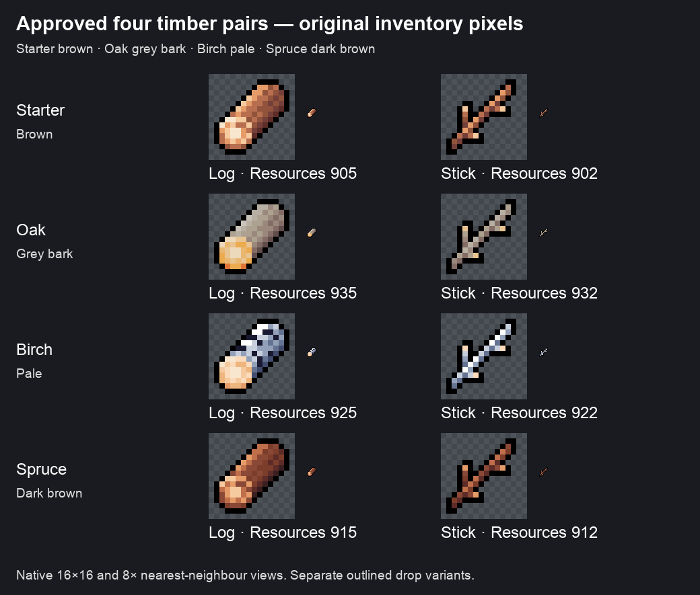

# Four wood pairs — colour order resolved

The user approved **Starter Brown → Oak GreyBark → Birch Pale → Spruce DarkBrown**. The earlier proposal combining starter and Oak, and the pending all-wood row-order interpretation, are superseded. The approved image retains Library identity `libfile_32a2716ea0d081919149bcf3eb18aa98`.

All sprites are from `Cute_Fantasy_Icons_Resources/Resources_all_16x16.png`, texture GUID `7cfa32f7f30ac7e45930f7df88eba5ba`.

| Family | Log number / fileID | Stick number / fileID |
| --- | --- | --- |
| Starter Brown | 905 / `736139449` | 902 / `-1305826939` |
| Oak GreyBark | 935 / `596812685` | 932 / `1893298941` |
| Birch Pale | 925 / `-1072138791` | 922 / `-489364232` |
| Spruce DarkBrown | 915 / `-941249751` | 912 / `891958766` |

The [current report](Echoes-premium-wood-icon-proposal.md) describes the actual resource setup, outlined drop variants, tests and Mac rendering. Exact spriteIDs, resource GUIDs and appended glyph indices are in the [timber manifest](../../development/timber-resources-2026-10-01/timber-manifest.json). Previous conflicting interpretations remain in [prior-version](prior-version/README.md).
