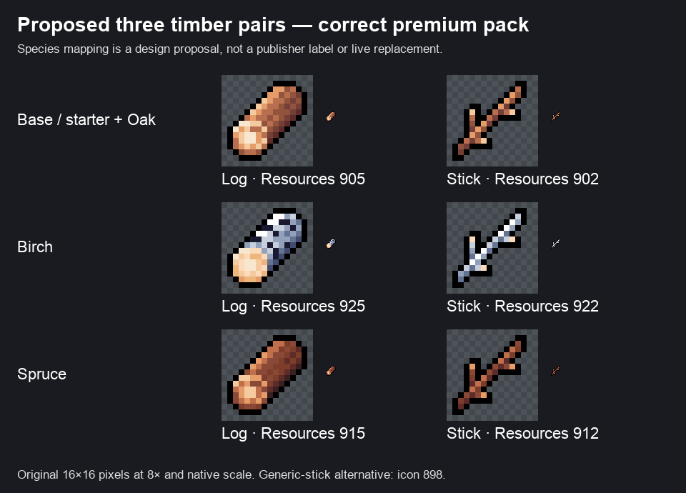

# Premium wood icon proposal

The correct remembered collection is now in Echoes: **Kenmi Cute Fantasy Icons Premium**, imported from the separately classified KenmiArtPacks collection by commit `093e6fdbe`. This supersedes the earlier wood proposals made from the base Cute Fantasy outdoor/Desert packs. Those earlier images remain historical evidence, not the recommended source.

The remote import landed on `fix/editor-startup-terrain-catalogue`, rather than a separate new branch. It was one direct descendant of our previous HEAD and contained only 60 additions: the premium asset folder, its parent metadata and `docs/PremiumIconImport.md`. We fast-forwarded that verified asset commit. No gameplay, resource definitions, save data, scenes or existing icon consumers were changed.

## Visually reviewed proposal

| Proposed family | Log | Stick/branch | Reason |
| --- | --- | --- | --- |
| Base wood: starter + Oak | Resources 905, `Brown_Log_Plain` | Resources 902, `Brown_Branch_Forked` | Familiar warm brown and a clear cut-log versus branch silhouette. |
| Birch | Resources 925, `Pale_Log_Plain` | Resources 922, `Pale_Branch_Forked` | White/blue bark with dark markings is visibly distinct at native scale. |
| Spruce | Resources 915, `DarkBrown_Log_Plain` | Resources 912, `DarkBrown_Branch_Forked` | Matching darker treatment; preserves the same log/branch shape language. |

These are **proposed species assignments**, not publisher-confirmed species labels or approved resource replacements. The catalogue's labels are descriptive, and these wood entries are marked `inferred_pending_user_review`. Brown versus dark brown is a smaller distinction than Birch versus brown: resource names and accessible text must identify the family, rather than relying on colour alone. The grey-bark family (935/932) is a visible alternative if the darker Spruce pair proves insufficiently distinct in the actual inventory.

The lowest-scope alternative is **three log types and one shared Stick**, using the genuine single-stick icon 898; 899/900 are pair/bundle illustrations, not grounds to invent separate resource quantities. This avoids extra stick-resource definitions and demand. Whether there should be three material pairs or three logs plus one shared Stick remains a gameplay decision.

Keep existing **Stick ID 2** and **Log ID 57**, their save identities and balances. Selecting premium art for those existing resources would be a later, explicit reference change. New Birch/Spruce resource identities, their consumers, values and drop routing are not created by this import or proposal. Farming mechanics implementation remains paused.

## Actual available art

The dedicated premium Resources folder contains 43 contiguous wood-region entries, 898–940: three generic stick icons and four colour treatments of bark, forked/crossed/thick branches, plain/leaf/stub logs, wide/narrow planks and strips. Plank art therefore exists; its availability does not authorize adding a plank economy or construction system. The leaf/stub log variants are alternatives, not additional required resources. These are inventory icons, not tree growth sprites or world harvest animations.

Both figures use exact source pixels with nearest-neighbour enlargement. They were visually inspected after rendering. No original art was recoloured, outlined, generated or repacked.

## Verification and provenance

- All 60 imported files match the source commit byte-for-byte.
- All nine sheets' **6,982 sprite names, IDs, 16×16 rectangles and centred pivots** match `IconSheetMap.json`; local sprite fileIDs are unique within each sheet.
- The 39 new asset GUIDs have no collisions with existing checkout metadata.
- Effective import settings are Sprite Multiple, 16 PPU, Point filtering, no mipmaps, no NPOT scaling and no compression. Standalone contains an inactive default-looking compressed setting with `overridden: 0`; the effective uncompressed default is retained. No metadata was normalized merely to remove that inactive field.
- The 592 pre-existing changed/untracked files were verified byte-identical after integration; the staging area was preserved. Main's baseline SHA-256 remains `8f912645ea9216c7f25a833da730c44524aaea0dab7ba4cd76a9c0e1ac0d9d54`.
- No local Unity runtime render or build was rerun for this additive import. The upstream import note reports Unity verification. The figures verify original pixel crops, not inventory/drop rendering through existing consumers; that later check belongs with an approved reference change.
- The included publisher licence permits project use and modification and prohibits redistribution/resale. Keep source assets within the licensed project; this proposal does not publish the collection.

[Exact GUID/fileID/rectangle/pixel evidence](wood-source-evidence.json) · [Import and preservation checks](import-verification.json) · [Upstream import note](../../PremiumIconImport.md)

No new commit, push, release or farming implementation was made. Only the authorized upstream asset commit was integrated; this proposal and its evidence remain uncommitted.
