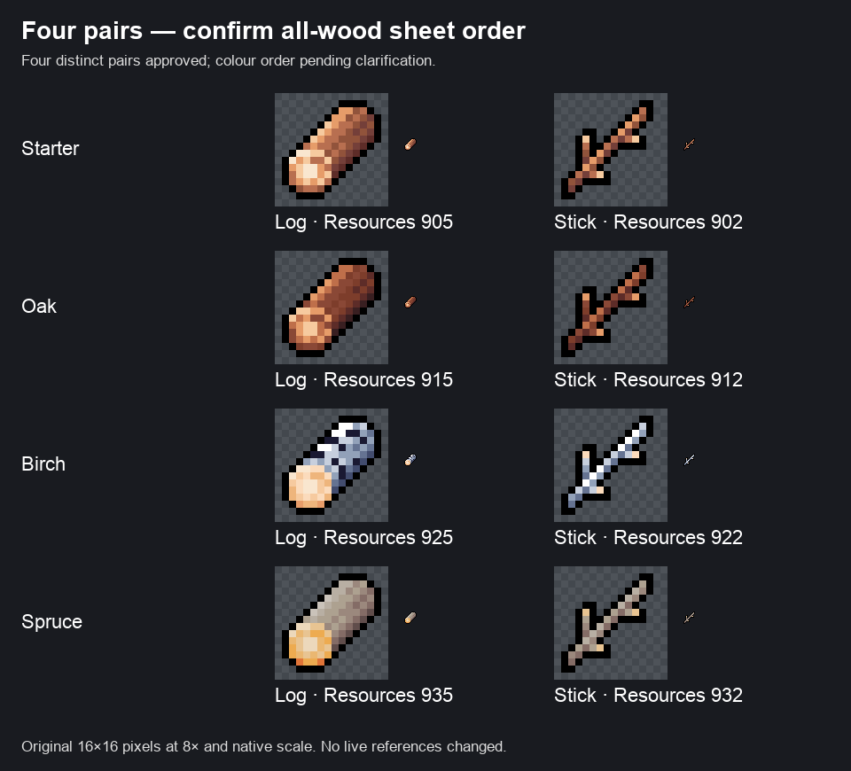

# Four wood pairs: approved count, colour order to confirm

The user has approved **four distinct log/stick pairs**, in tier order **starter → Oak → Birch → Spruce**. This supersedes the earlier proposal to combine starter and Oak. No balancing, drop routing or resource-reference change is authorized here.

There are two delivered images with different orders:

- `libfile_e98a65f98c3081919732510bea00d79d`, the [all-wood sheet](premium-wood-contact-sheet.png), has four wood-family rows: **Brown → DarkBrown → Pale → GreyBark**.
- `libfile_618c0fe05d7881918bae3262159435a0`, the [earlier three-pair proposal](premium-wood-proposal.png), has three rows: **Brown (starter + Oak) → Pale (Birch) → DarkBrown (Spruce)**. It omits GreyBark.

The four-row sheet is the natural interpretation of the new four-pair request, but it moves Spruce from DarkBrown to GreyBark compared with the earlier labelled proposal. The delegation explicitly requires clarification if the images support conflicting order. Confirm that the **four-row all-wood sheet controls the colour mapping** before recording these exact colours as approved.

## Four-row sheet interpretation, pending that confirmation

This clarification preview is saved separately as **`libfile_32a2716ea0d081919149bcf3eb18aa98`**; neither original delivered image was replaced.

All entries below are from `Cute_Fantasy_Icons_Resources/Resources_all_16x16.png`, texture GUID **`7cfa32f7f30ac7e45930f7df88eba5ba`**. Full sprite names use prefix `Resources_16x16_Icon_` plus the number and suffix shown.

| Tier | Colour | Log number / suffix / fileID | Stick number / suffix / fileID |
| --- | --- | --- | --- |
| Starter | Brown | 905 / `Brown_Log_Plain` / `736139449` | 902 / `Brown_Branch_Forked` / `-1305826939` |
| Oak | DarkBrown | 915 / `DarkBrown_Log_Plain` / `-941249751` | 912 / `DarkBrown_Branch_Forked` / `891958766` |
| Birch | Pale | 925 / `Pale_Log_Plain` / `-1072138791` | 922 / `Pale_Branch_Forked` / `-489364232` |
| Spruce | GreyBark | 935 / `GreyBark_Log_Plain` / `596812685` | 932 / `GreyBark_Branch_Forked` / `1893298941` |

| Tier | Log spriteID | Stick spriteID |
| --- | --- | --- |
| Starter | `bfef5942ebc72aecfdc7ec7b3101c2e6` | `409d39f678c3b8c4d357a9f3721b8472` |
| Oak | `c5c2613c86ec3a35be5b16fea35a89a3` | `33e848c16a22f2ac3f9337348d5bfe56` |
| Birch | `1015e107a92ff71ea5ef1c494679938d` | `d4d173137c81b7d7cedf4c82a0509797` |
| Spruce | `069bd393529374e197e1a9e1510048cb` | `0486519869d84065a6898c3a9d6bd5e4` |

Both exact delivered images were re-inspected from their preserved original local files. Library read confirmed their identities and matching byte sizes but returned extracted text rather than pixels. Original images and Library versions remain unchanged. These references agree with the source metadata and the [existing exact sprite evidence](wood-source-evidence.json).
